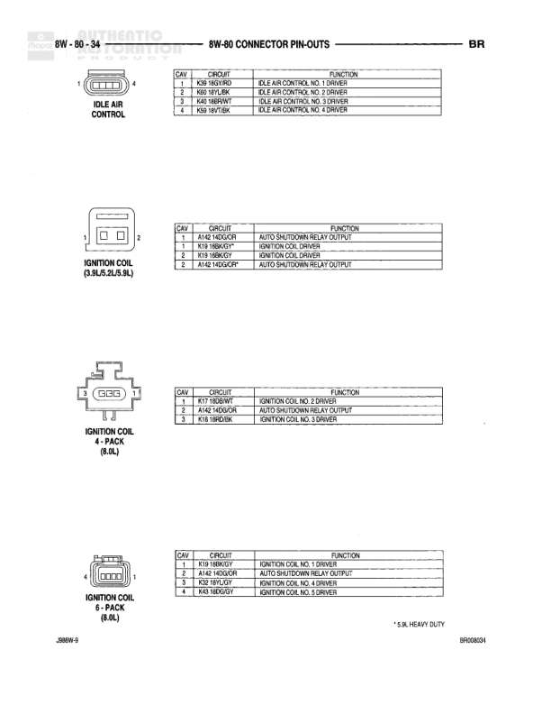

# 8W-80 Connector Pin-Outs

**Notes:** This page shows connector pin-out details for the Controller Antilock Brake (2 connectors) and Crankshaft Position Sensor

## Components

| Component | Ref | Connectors | Notes |
|-----------|-----|------------|-------|
| Controller Antilock Brake - C1 | 8W-80-21 | C1 | 14-pin connector |
| Controller Antilock Brake - C2 (ABS) | 8W-80-21 | C2 | 4-pin connector |
| Crankshaft Position Sensor | 8W-80-21 | 3-pin connector | 3-pin connector |

## Wires

| From | To | Wire Code | Gauge | Color | Notes |
|------|-----|-----------|-------|-------|-------|
| Controller Antilock Brake C1 Pin 1 | B113 20RD/GN | B113 | 20 | RD/GN | FUSED IGNITION |
| Controller Antilock Brake C1 Pin 2 | L16 20PK | L16 | 20 | PK | FOUR WHEEL DRIVE SENSE |
| Controller Antilock Brake C1 Pin 3 | D1 20YL/BR | D1 | 20 | YL/BR | CCD BUS (+) |
| Controller Antilock Brake C1 Pin 4 | A20 20RD/DB | A20 | 20 | RD/DB | FUSED B (+) |
| Controller Antilock Brake C1 Pin 6 | Z8 14BK/WT | Z8 | 14 | BK/WT | GROUND |
| Controller Antilock Brake C1 Pin 7 | A10 14RD/DG | A10 | 14 | RD/DG | FUSED (+) |
| Controller Antilock Brake C1 Pin 8 | B114 20WT/GY | B114 | 20 | WT/GY | RIGHT REAR WHEEL SPEED SENSOR (+) |
| Controller Antilock Brake C1 Pin 9 | M9 20WT/BK | M9 | 20 | WT/BK | BRAKE SWITCH SENSE |
| Controller Antilock Brake C1 Pin 10 | D6 20VT/WT | D6 | 20 | VT/WT | CCD BUS (-) |
| Controller Antilock Brake C1 Pin 11 | G9 20GY/BK | G9 | 20 | GY/BK | RED BRAKE WARNING LAMP DRIVER |
| Controller Antilock Brake C1 Pin 12 | G7 20WT/OR | G7 | 20 | WT/OR | VEHICLE SPEED SENSOR SIGNAL |
| Controller Antilock Brake C1 Pin 13 | B115 20BR/LB | B115 | 20 | BR/LB | RIGHT REAR WHEEL SPEED SENSOR (-) |
| Controller Antilock Brake C1 Pin 14 | A10 16RD/DG | A10 | 16 | RD/DG | FUSED B (+) |
| Controller Antilock Brake C2 Pin 1 | B8 22RD | B8 | 22 | RD | LEFT FRONT WHEEL SPEED SENSOR (+) |
| Controller Antilock Brake C2 Pin 2 | B6 20PK/VT | B6 | 20 | PK/VT | LEFT FRONT WHEEL SPEED SENSOR (-) |
| Controller Antilock Brake C2 Pin 3 | B9 20WT/DB | B9 | 20 | WT/DB | RIGHT FRONT WHEEL SPEED SENSOR (+) |
| Controller Antilock Brake C2 Pin 4 | B7 20GY | B7 | 20 | GY | RIGHT FRONT WHEEL SPEED SENSOR (-) |
| Crankshaft Position Sensor Pin 1 | K24 18VT/BK | K24 | 18 | VT/BK | CRANK POSITION SENSOR SIGNAL |
| Crankshaft Position Sensor Pin 2 | K4 18DG/LB | K4 | 18 | DG/LB | SENSOR GROUND |
| Crankshaft Position Sensor Pin 3 | K9 20VT/WT | K9 | 20 | VT/WT | 5 VOLT SUPPLY |
