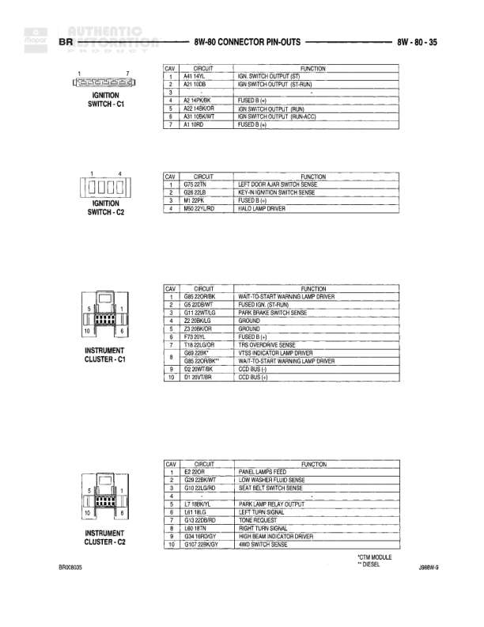

# Connector Pin-Outs

**Notes:** Connector pin-out reference page showing Cup Holder Lamp, Data Link Connector (OBD-II), Day/Night Mirror, and Daytime Running Lamp Module. * DIESEL notation indicates certain circuits may be specific to diesel engines. Cavity numbers with dashes indicate empty/unused pins.

## Components

| Component | Ref | Connectors | Notes |
|-----------|-----|------------|-------|
| Cup Holder Lamp | 8W-80-22 | 2-pin connector | Cup holder illumination lamp |
| Data Link Connector | 8W-80-22 | 16-pin connector | Standard OBD-II diagnostic connector |
| Day/Night Mirror | 8W-80-22 | 3-pin connector | Auto-dimming mirror with backup lamp sense |
| Daytime Running Lamp Module | 8W-80-22 | 10-pin connector | Controls daytime running lamps |

## Wires

| From | To | Wire Code | Gauge | Color | Notes |
|------|-----|-----------|-------|-------|-------|
| Cup Holder Lamp Pin 1 | L10 20BR/LG | L10 | 20 | BR/LG | Cup Holder Lamp Feed |
| Cup Holder Lamp Pin 2 | Z1 20BK/OR | Z1 | 20 | BK/OR | Ground |
| Data Link Connector Pin 3 | D1 18WT/BR | D1 | 18 | WT/BR | COD BUS (+) |
| Data Link Connector Pin 4 | Z12 20BK/TN | Z12 | 20 | BK/TN | Ground |
| Data Link Connector Pin 5 | Z12 18BK/TN | Z12 | 18 | BK/TN | Ground |
| Data Link Connector Pin 6 | D20 20LG | D20 | 20 | LG | SCI RECEIVE |
| Data Link Connector Pin 7 | D21 20PK/LB | D21 | 20 | PK/LB | SCI TRANSMIT |
| Data Link Connector Pin 11 | D2 18WT/BK | D2 | 18 | WT/BK | COD BUS (-) |
| Data Link Connector Pin 14 | D320 20WT/VT | D320 | 20 | WT/VT | SCI RECEIVE |
| Data Link Connector Pin 16 | M1 20PK | M1 | 20 | PK | FUSED B (+) |
| Day/Night Mirror Pin 1 | K12 20BR/WT | K12 | 20 | BR/WT | FUSED DRL (SWITCHED) |
| Day/Night Mirror Pin 2 | Z1 20BK | Z1 | 20 | BK | Ground |
| Day/Night Mirror Pin 3 | L1 20WT/BK | L1 | 20 | WT/BK | Backup Lamp Sense |
| Daytime Running Lamp Module Pin 1 | L5 16RD/GN | L5 | 16 | RD/GN | High Beam Output |
| Daytime Running Lamp Module Pin 2 | G11 20WT/YL | G11 | 20 | WT/YL | Parking Brake Switch Sense |
| Daytime Running Lamp Module Pin 3 | G34 20RD/VT | G34 | 20 | RD/VT | High Beam Indicator |
| Daytime Running Lamp Module Pin 4 | L10 18BR/LG | L10 | 18 | BR/LG | Fused DRL (RUN) |
| Daytime Running Lamp Module Pin 5 | L32 18LG/WT | L32 | 18 | LG/WT | FUSED B (+) |
| Daytime Running Lamp Module Pin 8 | Z1 18BK | Z1 | 18 | BK | Ground |
| Daytime Running Lamp Module Pin 10 | L4 16WT/WT | L4 | 16 | WT/WT | Low Beam Output |
