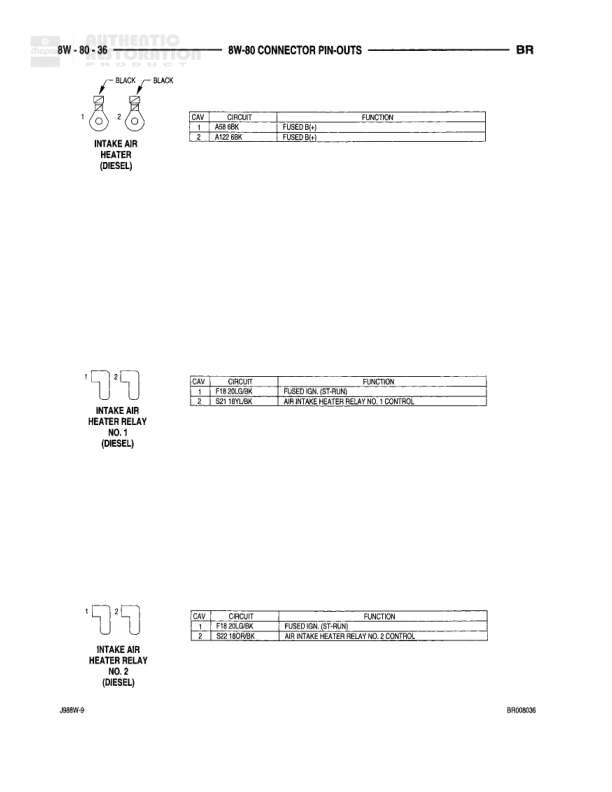

# 8W-80 Connector Pin-Outs

**Notes:** This page shows connector pin-out information for various components. Driver Seat Solenoid marked as W/CENTRIPIAL TAMER MODULE. Document identifiers: BPR002023 and 4889W-9

## Components

| Component | Ref | Connectors | Notes |
|-----------|-----|------------|-------|
| Dome Lamp | 8W-80-23 | C1 (2-pin) | 2-pin connector |
| Downstream Heated Oxygen Sensor | 8W-80-23 | C1 (4-pin) | 4-pin connector |
| Driver Airbag | 8W-80-23 | C1 (2-pin) | 2-pin connector |
| Driver Seat Solenoid | 8W-80-23 | C1 (2-pin) | 2-pin connector, W/CENTRIPIAL TAMER MODULE |

## Wires

| From | To | Wire Code | Gauge | Color | Notes |
|------|-----|-----------|-------|-------|-------|
| Dome Lamp Pin 1 | None | M2 | 20 | YL | DOOR JAMB SWITCH |
| Dome Lamp Pin 2 | None | M1 | 20 | PK | FUSED B (+) |
| Downstream Heated Oxygen Sensor Pin 1 | None | K41 | 18 | DG/RD | DOWNSTREAM RELAY OUTPUT |
| Downstream Heated Oxygen Sensor Pin 2 | None | Z11 | 18 | BK/WT | GROUND |
| Downstream Heated Oxygen Sensor Pin 3 | None | K4 | 18 | BK/LB | SENSOR GROUND |
| Downstream Heated Oxygen Sensor Pin 4 | None | K41 | None | HO/TN/PK | HEATED OXYGEN SENSOR SIGNAL |
| Driver Airbag Pin 1 | None | R43 | 18 | PK/LB | DRIVER AIRBAG LINE 1 |
| Driver Airbag Pin 2 | None | R44 | 18 | VT/LB | DRIVER AIRBAG LINE 2 |
| Driver Seat Solenoid Pin 1 | None | F2 | 18 | RD/LG | GROUND |
| Driver Seat Solenoid Pin 2 | None | S2 | 20 | DG/RD | INITIAL PITCH ABCM |
