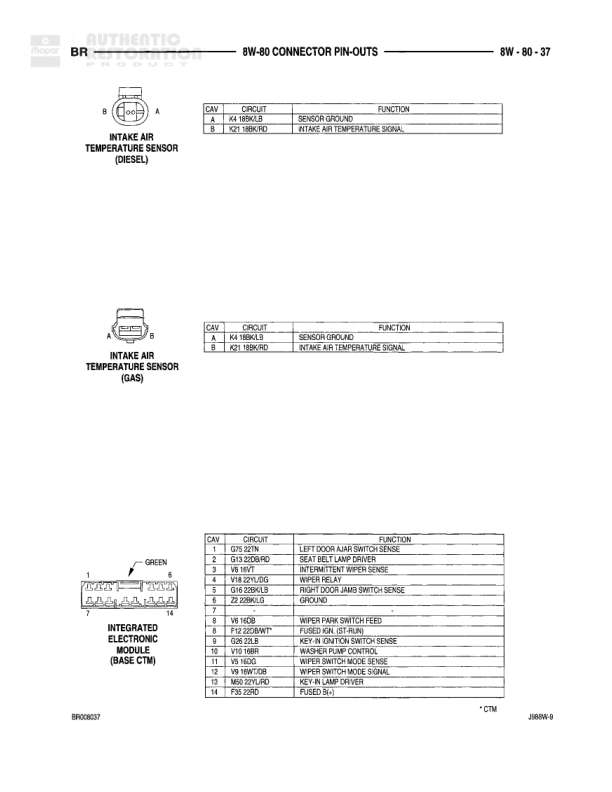

# Connector Pin-Outs

**Notes:** This is a connector pin-out reference page showing the cavity assignments and circuit functions for various sensors and solenoids. Pin-out details are provided for both diesel and gas engine variants where applicable.

## Components

| Component | Ref | Connectors | Notes |
|-----------|-----|------------|-------|
| Duty Cycle Evap/Purge Solenoid | 8W-80-24 | 2-pin connector | 2-cavity connector shown |
| EGR Solenoid (Diesel) | 8W-80-24 | 2-pin connector | 2-cavity connector shown |
| Electric Brake | 8W-80-24 | 4-pin connector | 4-cavity connector shown |
| Engine Coolant Temperature Sensor (Diesel) | 8W-80-24 | 2-pin connector | 2-cavity connector shown |
| Engine Coolant Temperature Sensor (Gas) | 8W-80-24 | 2-pin connector | 2-cavity connector shown |

## Wires

| From | To | Wire Code | Gauge | Color | Notes |
|------|-----|-----------|-------|-------|-------|
| Duty Cycle Evap/Purge Solenoid Pin 1 | None | K26 | None | None | Evaporative Emission Solenoid Control |
| Duty Cycle Evap/Purge Solenoid Pin 2 | None | F12 | None | None | Fused B+ (Return) |
| EGR Solenoid (Diesel) Pin 1 | None | K27 | None | None | EGR S/V (Non Control) Signal |
| EGR Solenoid (Diesel) Pin 2 | None | F14 | None | None | S/V, Feed for EGR |
| Electric Brake Pin 1 | None | A4 | None | None | Fused B (+) |
| Electric Brake Pin 2 | None | B5 | None | None | Trailer Tow B (+) |
| Electric Brake Pin 3 | None | L50 | None | None | Stop Lamp Switch Output |
| Electric Brake Pin 4 | None | Z3 | None | None | Ground |
| Engine Coolant Temperature Sensor (Diesel) Pin 1 | None | K4 | None | None | Sensor Ground |
| Engine Coolant Temperature Sensor (Diesel) Pin 2 | None | K2 | None | None | Engine Coolant Temperature Sensor Signal |
| Engine Coolant Temperature Sensor (Gas) Pin 1 | None | K4 | None | None | Sensor Ground |
| Engine Coolant Temperature Sensor (Gas) Pin 2 | None | K2 | None | None | Engine Coolant Temperature Sensor Signal |
