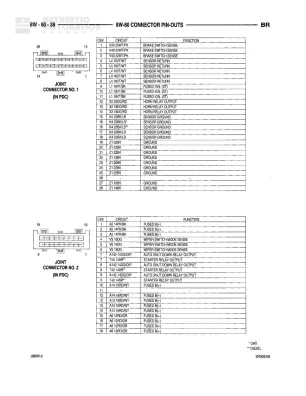

# 8W-80 CONNECTOR PIN-OUTS

**Notes:** This page shows connector pin-out information for Engine Oil Pressure Sensor, Engine Speed Sensor (Diesel), and Engine Starter Motor. Document reference: BR00605, Page 3999W-9

## Components

| Component | Ref | Connectors | Notes |
|-----------|-----|------------|-------|
| ENGINE OIL PRESSURE SENSOR | 8W-80-25 | 2-pin connector | 2-pin connector shown |
| ENGINE SPEED SENSOR (DIESEL) | 8W-80-25 | 3-pin connector | 3-pin connector shown |
| ENGINE STARTER MOTOR | 8W-80-25 | 2-terminal connector | Starter motor with relay output and B(+) connections |

## Wires

| From | To | Wire Code | Gauge | Color | Notes |
|------|-----|-----------|-------|-------|-------|
| ENGINE OIL PRESSURE SENSOR Pin 1 | SENSOR GROUND | K4 | 18 | BK/LB |  |
| ENGINE OIL PRESSURE SENSOR Pin 2 | ENGINE OIL PRESSURE SENSE TO PCM | K66 | 18 | BR/VT |  |
| ENGINE SPEED SENSOR (DIESEL) Pin 1 | 5 VOLT SUPPLY | K6 | 20 | VT/WT |  |
| ENGINE SPEED SENSOR (DIESEL) Pin 2 | SENSOR GROUND | K4 | 18 | BK/LB |  |
| ENGINE SPEED SENSOR (DIESEL) Pin 3 | CRANK POSITION SENSOR SIGNAL | K24 | 18 | TN/BK |  |
| ENGINE STARTER MOTOR Terminal A | STARTER RELAY OUTPUT | T46 | 10 | BR |  |
| ENGINE STARTER MOTOR Terminal B | B(+) | A4 | None | RD | Battery positive feed |
