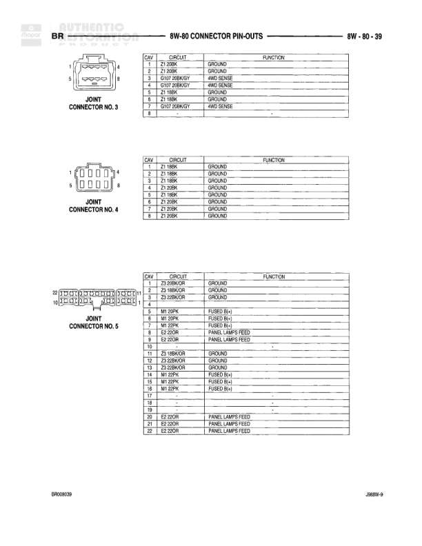

# BR - CONNECTOR PIN-OUTS

**Notes:** Connector pin-out reference page showing FOG LAMP SWITCH (6-pin), FRONT VERTICAL SEAT MOTOR (2-pin), and FUEL HEATER DIESEL (2-pin) connector configurations and pin functions. Document reference: JR8W-6 BR090805

## Components

| Component | Ref | Connectors | Notes |
|-----------|-----|------------|-------|
| FOG LAMP SWITCH | 8W-80-26 | 6-pin connector | 6-cavity connector shown with pin numbering |
| FRONT VERTICAL SEAT MOTOR | 8W-80-26 | 2-pin connector | 2-cavity connector shown |
| FUEL HEATER (DIESEL) | 8W-80-26 | 2-pin connector | 2-cavity connector shown |

## Wires

| From | To | Wire Code | Gauge | Color | Notes |
|------|-----|-----------|-------|-------|-------|
| FOG LAMP SWITCH Pin 1 | GROUND | Z3 | 20 | BK/OR | Z3 20BK/OR |
| FOG LAMP SWITCH Pin 2 | GROUND | Z3 | 20 | BK/OR | Z3 20BK/OR |
| FOG LAMP SWITCH Pin 3 | FOG LAMP RELAY CONTROL | L35 | 20 | BR/YL | L35 20BR/YL |
| FOG LAMP SWITCH Pin 4 | HEADLAMP DIMMER SWITCH OUTPUT | L6 | 18 | DB/OR | L6 18DB/OR |
| FOG LAMP SWITCH Pin 5 | FUSED PANEL LAMPS DIMMER SWITCH SENSE | E2 | 20 | OR | E2 20OR |
| FRONT VERTICAL SEAT MOTOR Pin 1 | LEFT FRONT POWER SEAT FRONT DOWN | P18 | 14 | LB/LG | P18 14LB/LG - LEFT FRONT POWER SEAT FRONT HOOK UP |
| FRONT VERTICAL SEAT MOTOR Pin 2 | LEFT FRONT POWER SEAT FRONT DOWN | P21 | 14 | RD/LG | P21 14RD/LG - LEFT FRONT POWER SEAT FRONT DOWN |
| FUEL HEATER (DIESEL) Pin 1 | FUEL HEATER RELAY OUTPUT | F36 | 12 | RD/WT | F36 12RD/WT |
| FUEL HEATER (DIESEL) Pin 2 | GROUND | Z12 | 12 | BK/TN | Z12 12BK/TN |
