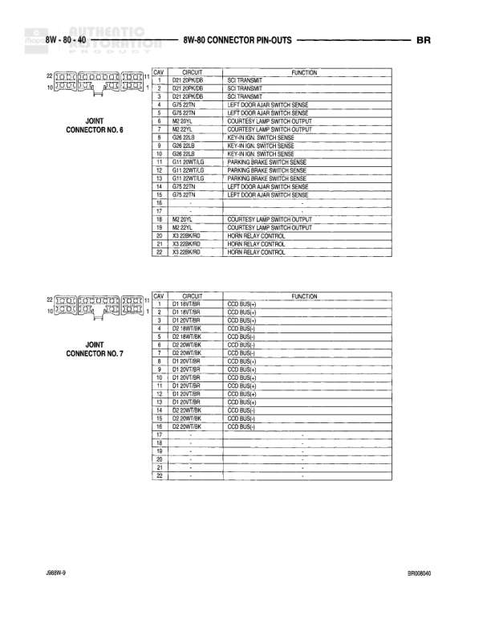

# CONNECTOR PIN-OUTS - FUEL INJECTORS

**Notes:** This diagram shows connector pin-out information for fuel injectors. Each injector has a 2-pin connector with the following circuits: CAV 1 contains Auto Shutdown Relay Output circuit (K41/K51/K58), CAV 2 contains Injector Driver circuits (K42/K52 for NO.2 & 4, K43/K45 for NO.4 & 2, K44/K46 for NO.5 & 6, K18 for NO.2 8.0L, K42 for NO.4 8.0L, K38 for NO.5 8.0L, K39 for NO.6 8.0L). Different engine sizes (3.8L, 4.7L, 5.9L, 8.0L, 3.9L, 5.2L) are noted for different injector configurations.

## Components

| Component | Ref | Connectors | Notes |
|-----------|-----|------------|-------|
| FUEL INJECTOR NO. 2 | 8W-80-28 | 2-pin connector | 3.8L,4.7L,5.9L |
| FUEL INJECTOR NO. 4 | 8W-80-28 | 2-pin connector | 8.0L |
| FUEL INJECTOR NO. 2 | 8W-80-28 | 2-pin connector | 3.9L,5.2L,5.9L |
| FUEL INJECTOR NO. 5 | 8W-80-28 | 2-pin connector | 8.0L |
| FUEL INJECTOR NO. 4 | 8W-80-28 | 2-pin connector | 3.9L,5.2L,5.9L |
| FUEL INJECTOR NO. 6 | 8W-80-28 | 2-pin connector | 8.0L |
