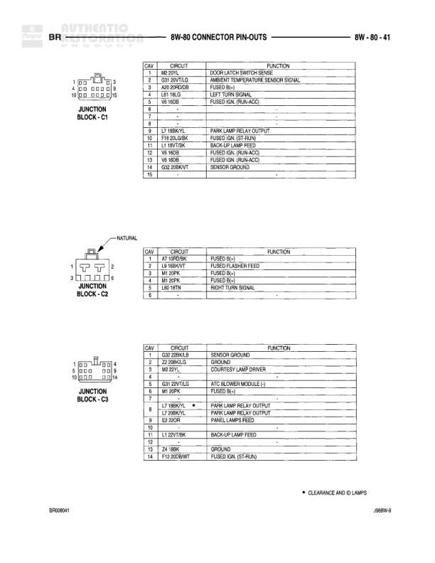

# 8W-80 CONNECTOR PIN-OUTS

**Notes:** Connector pin-outs for fuel injectors 7-10. Injectors 7 and 8 apply to 5.2L, 5.9L, and 8.0L engines. Injectors 9 and 10 apply to 8.0L engine only. All injectors use common ASD (Auto Shutdown) relay output on cavity 2.

## Components

| Component | Ref | Connectors | Notes |
|-----------|-----|------------|-------|
| FUEL INJECTOR NO. 7 | 8W-80-29 | 2-way connector (5.2L/5.9L) | 2-pin connector for 5.2L/5.9L engines |
| FUEL INJECTOR NO. 7 | 8W-80-29 | 2-way connector (8.0L) | 2-pin connector for 8.0L engine |
| FUEL INJECTOR NO. 8 | 8W-80-29 | 2-way connector (5.2L/5.9L) | 2-pin connector for 5.2L/5.9L engines |
| FUEL INJECTOR NO. 8 | 8W-80-29 | 2-way connector (8.0L) | 2-pin connector for 8.0L engine |
| FUEL INJECTOR NO. 9 | 8W-80-29 | 2-way connector (8.0L) | 2-pin connector for 8.0L engine only |
| FUEL INJECTOR NO. 10 | 8W-80-29 | 2-way connector (8.0L) | 2-pin connector for 8.0L engine only |

## Wires

| From | To | Wire Code | Gauge | Color | Notes |
|------|-----|-----------|-------|-------|-------|
| FUEL INJECTOR NO. 7 (5.2L/5.9L) | Cavity 1 | K25 | 18 | TN/TN | INJECTOR NO. 7 DRIVER |
| FUEL INJECTOR NO. 7 (5.2L/5.9L) | Cavity 2 | K38 | 18 | GY | INJECTOR NO. 7 DRIVER |
| FUEL INJECTOR NO. 7 (5.2L/5.9L) | Cavity 2 | A142 | 18 | DG/OR | AUTO SHUTDOWN RELAY AT OUTPUT |
| FUEL INJECTOR NO. 7 (8.0L) | Cavity 1 | K25 | 18 | TN/TN | INJECTOR NO. 7 DRIVER |
| FUEL INJECTOR NO. 7 (8.0L) | Cavity 2 | A142 | 18 | DG/OR | AUTO SHUTDOWN RELAY AT OUTPUT |
| FUEL INJECTOR NO. 8 (5.2L/5.9L) | Cavity 1 | K28 | 18 | VT/LB | INJECTOR NO. 8 DRIVER |
| FUEL INJECTOR NO. 8 (5.2L/5.9L) | Cavity 2 | A142 | 18 | DG/OR | AUTO SHUTDOWN RELAY AT OUTPUT |
| FUEL INJECTOR NO. 8 (8.0L) | Cavity 1 | K28 | 18 | VT/LB | INJECTOR NO. 8 DRIVER |
| FUEL INJECTOR NO. 8 (8.0L) | Cavity 2 | A142 | 18 | DG/OR | AUTO SHUTDOWN RELAY AT OUTPUT |
| FUEL INJECTOR NO. 9 (8.0L) | Cavity 1 | K115 | 18 | TN/BK | INJECTOR NO. 9 DRIVER |
| FUEL INJECTOR NO. 9 (8.0L) | Cavity 2 | A142 | 18 | DG/OR | AUTO SHUTDOWN RELAY AT OUTPUT |
| FUEL INJECTOR NO. 10 (8.0L) | Cavity 1 | K116 | 18 | GY | INJECTOR NO. 10 DRIVER |
| FUEL INJECTOR NO. 10 (8.0L) | Cavity 2 | A142 | 18 | DG/OR | AUTO SHUTDOWN RELAY AT OUTPUT |
