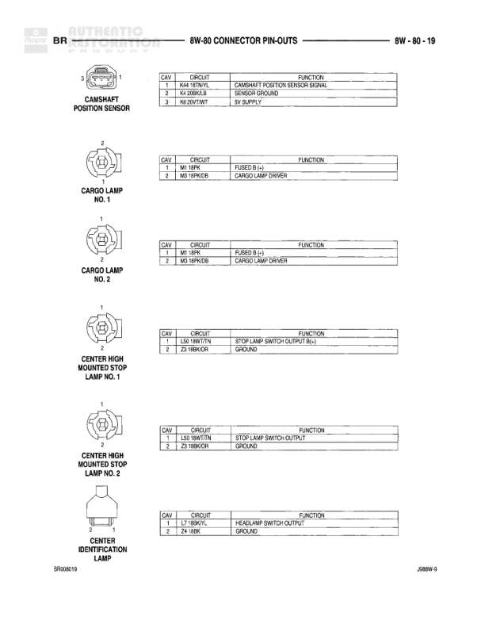

# 8W - 80 CONNECTOR PIN-OUTS

**Notes:** This is an index/table of contents page listing connector pin-out diagrams and their corresponding page numbers. No actual wiring diagram information is present on this page.

## Components

| Component | Ref | Connectors | Notes |
|-----------|-----|------------|-------|
| Leak Detection Pump | 8W-80-43 |  |  |
| Left Back Up Lamp | 8W-80-43 |  |  |
| Left Door Disarm Switch | 8W-80-43 |  |  |
| Left Door Jamb Switch | 8W-80-44 |  |  |
| Left Door Lock Motor | 8W-80-44 |  |  |
| Left Door Window/Lock Switch | 8W-80-44 |  |  |
| Left Fog Lamp | 8W-80-44 |  |  |
| Left Front Door Speaker | 8W-80-45 |  |  |
| Left Front Fender Lamp | 8W-80-45 |  |  |
| Left Front Wheel Speed Sensor | 8W-80-45 |  |  |
| Left Headlamp | 8W-80-45 |  |  |
| Left High/Low Beam Headlamp | 8W-80-45, 46 |  |  |
| Left Outboard Clearance Lamp | 8W-80-46 |  |  |
| Left Outboard Identification Lamp | 8W-80-46 |  |  |
| Left Park/Turn Signal Lamp | 8W-80-46 |  |  |
| Left Power Mirror Motors | 8W-80-46 |  |  |
| Left Rear Door Speaker | 8W-80-47 |  |  |
| Left Rear Fender Lamp | 8W-80-47 |  |  |
| Left Rear Speaker | 8W-80-47 |  |  |
| Left Tail/Stop/Turn Signal Lamp | 8W-80-47 |  |  |
| Left Tailgate Lamp | 8W-80-48 |  |  |
| Left Tweeter | 8W-80-48 |  |  |
| Left Upstream Heated Oxygen Sensor | 8W-80-48 |  |  |
| Left Viper/Vanity Lamp | 8W-80-48 |  |  |
| Low Note Horn | 8W-80-48 |  |  |
| Low Washer Fluid Switch | 8W-80-49 |  |  |
| Memory Seat Module | 8W-80-49 |  |  |
| Multi-Function Switch | 8W-80-49 |  |  |
| Overdrive Switch | 8W-80-50 |  |  |
| Overhead Console | 8W-80-50 |  |  |
| Overhead Map/Courtesy Lamp | 8W-80-50 |  |  |
| Overhead Rear Console Switch | 8W-80-50 |  |  |
| Passenger Airbag | 8W-80-50 |  |  |
| Passenger Airbag Disarm -C1 | 8W-80-51 |  |  |
| Passenger Airbag Disarm -C2 | 8W-80-51 |  |  |
| Passenger Seat Solenoid | 8W-80-51 |  |  |
| Post-Catalyst Heated Oxygen Sensor | 8W-80-51 |  |  |
| Power Mirror Switch | 8W-80-51 |  |  |
| Power Seat Module | 8W-80-52 |  |  |
| Power Seat Switch | 8W-80-52 |  |  |
| Powertrain Control Module C1 | 8W-80-52, 53, 54 |  |  |
| Powertrain Control Module C2 | 8W-80-56, 56, 57 |  |  |
| Powertrain Control Module C3 | 8W-80-58, 59, 60 |  |  |
| Pre-Catalyst Heated Oxygen Sensor | 8W-80-60 |  |  |
