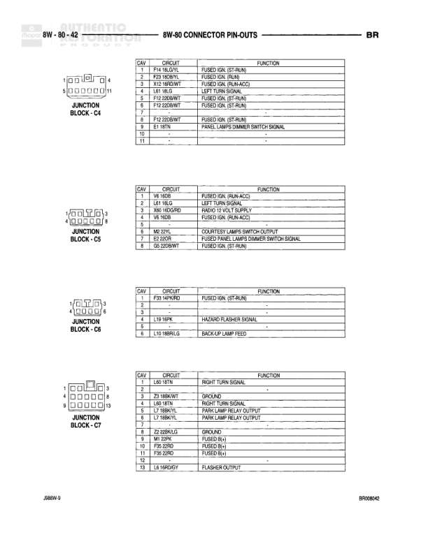

# 8W-80 CONNECTOR PIN-OUTS

**Notes:** This is a connector pin-out reference page showing three components: Fuel Pump Module (4-pin), Fuel Shut Down Relay (4-pin), and Fuel Shut Down Solenoid (4-pin). Each component shows pin numbering and circuit assignments in accompanying tables.

## Components

| Component | Ref | Connectors | Notes |
|-----------|-----|------------|-------|
| FUEL PUMP MODULE | 8W-80-30 | 4-pin connector | 4-pin module connector |
| FUEL SHUT DOWN RELAY | 8W-80-30 | 4-pin relay | Standard automotive relay configuration |
| FUEL SHUT DOWN SOLENOID | 8W-80-30 | 4-pin connector | Solenoid connector labeled C to A |
