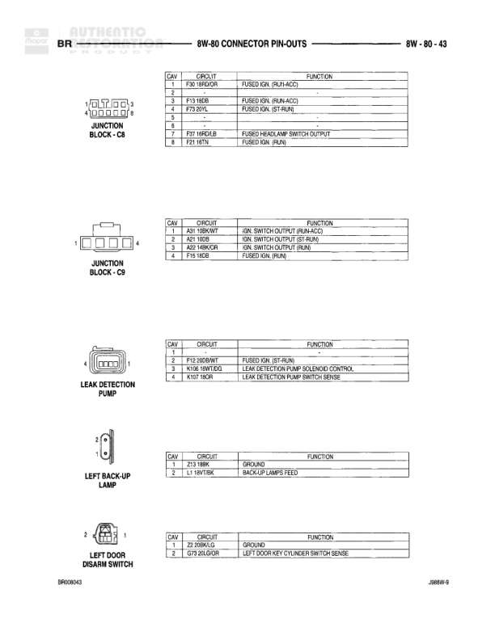

# 8W-80 CONNECTOR PIN-OUTS

**Notes:** This page shows connector pin-outs for Generator (Diesel and Gas variants) and Glove Box Lamp. Document BR000201, J6800-9

## Components

| Component | Ref | Connectors | Notes |
|-----------|-----|------------|-------|
| Generator (Diesel) | 8W-80-31 | 3-pin connector | 3-cavity connector with pins 1, 2, 4 |
| Generator (Gas) | 8W-80-31 | 3-pin connector | 3-cavity connector with pins 1, 2, 3 |
| Glove Box Lamp | 8W-80-31 | 2-pin connector | 2-cavity connector with pins 1 and 2 |

## Wires

| From | To | Wire Code | Gauge | Color | Notes |
|------|-----|-----------|-------|-------|-------|
| Generator (Diesel) Pin 3 | None | K20 | 16 | DG | Generator Field Driver |
| Generator (Diesel) Pin 2 | None | K19 | 18 | BR | Generator (GF) Field B(+) |
| Generator (Diesel) Pin 1 | None | K18 | 18 | BR | Generator Output |
| Generator (Diesel) Pin 4 | None | Z1 | 18 | BK | Ground |
| Generator (Gas) Pin 1 | None | K20 | 14 | DG | Generator Field Driver |
| Generator (Gas) Pin 2 | None | T13 | 18 | RD | Generator Field B(+) |
| Generator (Gas) Pin 3 | None | Z1 | 18 | BK | Ground |
| Glove Box Lamp Pin 1 | None | M | 20 | PK | Fused B(+) |
| Glove Box Lamp Pin 2 | None | Z3 | 20 | GY | Ground |
