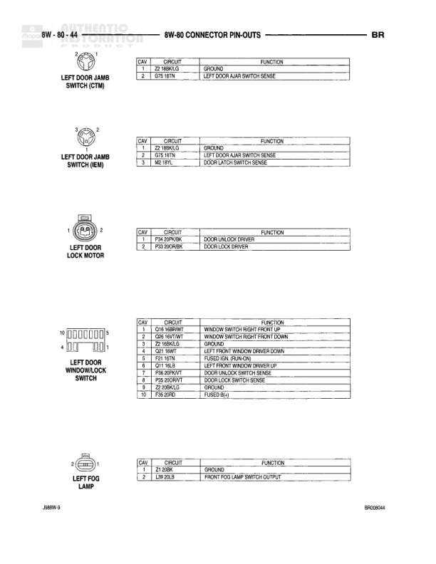

# 8W-80 CONNECTOR PIN-OUTS

**Notes:** Connector pin-out diagram showing headlamp switch connectors C1 (2-pin) and C2 (10-pin) with circuit functions and wire assignments

## Components

| Component | Ref | Connectors | Notes |
|-----------|-----|------------|-------|
| Headlamp Switch | C1 | C1 | 2-pin connector |
| Headlamp Switch | C2 | C2 | 10-pin connector |

## Wires

| From | To | Wire Code | Gauge | Color | Notes |
|------|-----|-----------|-------|-------|-------|
| HEADLAMP SWITCH-C1 | Pin 1 | M2 | 20 | WT/L | COURTESY LAMPS SWITCH OUTPUT |
| HEADLAMP SWITCH-C1 | Pin 2 | Z3 | None | BK/GR | GROUND |
| HEADLAMP SWITCH-C2 | Pin A | A3 | 18 | BR/WT | FUSED B (+) |
| HEADLAMP SWITCH-C2 | Pin B | F31 | 18 | GR/RD | FUSED B (+) |
| HEADLAMP SWITCH-C2 | Pin C | Q47 | 20 | WT/LB | INDICATOR SWITCH SENSE |
| HEADLAMP SWITCH-C2 | Pin D | L2 | 16 | WT/LB | HEADLAMP POWER |
| HEADLAMP SWITCH-C2 | Pin H | L2 | 16 | LG/LG | HEADLAMP SWITCH OUTPUT |
| HEADLAMP SWITCH-C2 | Pin J | E1 | 18 | TN/N | PANEL LAMPS DIMMER SWITCH SIGNAL |
| HEADLAMP SWITCH-C2 | Pin K | L7 | 18 | BR/WT | PARK LAMP POWER |
| HEADLAMP SWITCH-C2 | Pin R | L7 | 18 | BR/YL | PARK LAMP SWITCH OUTPUT |
| HEADLAMP SWITCH-C2 | Pin U | Q73 | 22 | WT/N | LEFT DOOR AJAR SWITCH SENSE |
