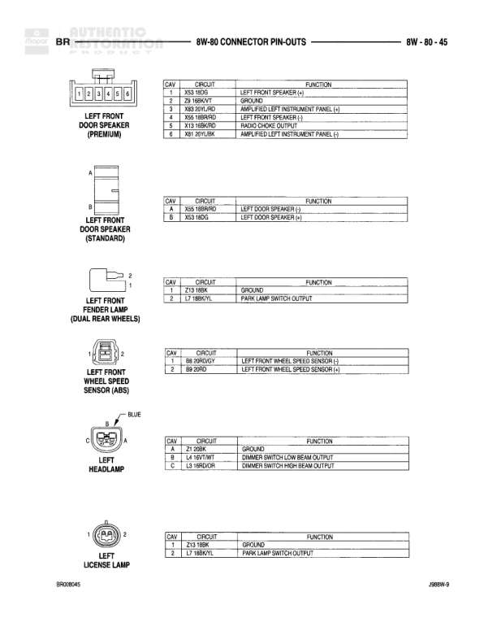

# Connector Pin-Outs

**Notes:** Connector pin-out reference page showing IDLE AIR CONTROL, IGNITION COIL configurations for different engine types (3.9L/5.2L/5.9L, 4-PACK V/L, 8-PACK 8.0L). 5.9L HEAVY DUTY variant noted for 8-PACK configuration.

## Components

| Component | Ref | Connectors | Notes |
|-----------|-----|------------|-------|
| IDLE AIR CONTROL | 8W-80-34 | 4-pin connector | 4-pin connector shown |
| IGNITION COIL (3.9L/5.2L/5.9L) | 8W-80-34 | 2-pin connector | 2-pin connector shown |
| IGNITION COIL 4-PACK (V/L) | 8W-80-34 | 3-pin connector | 3-pin connector shown |
| IGNITION COIL 8-PACK (8.0L) | 8W-80-34 | 4-pin connector | 4-pin connector shown, 5.9L HEAVY DUTY |

## Wires

| From | To | Wire Code | Gauge | Color | Notes |
|------|-----|-----------|-------|-------|-------|
| IDLE AIR CONTROL Pin 1 | IDLE AIR CONTROL NO. 1 DRIVER | K39 | 18 | GY/RD |  |
| IDLE AIR CONTROL Pin 2 | IDLE AIR CONTROL NO. 2 DRIVER | K92 | 18 | YL/BK |  |
| IDLE AIR CONTROL Pin 3 | IDLE AIR CONTROL NO. 3 DRIVER | K40 | 18 | BR/WT |  |
| IDLE AIR CONTROL Pin 4 | IDLE AIR CONTROL NO. 4 DRIVER | K93 | 18 | VT/BK |  |
| IGNITION COIL (3.9L/5.2L/5.9L) Pin 1 | AUTO SHUTDOWN RELAY OUTPUT | A142 | 14 | DG/OR |  |
| IGNITION COIL (3.9L/5.2L/5.9L) Pin 2 | IGNITION COIL DRIVER | K19 | 18 | BR/GY |  |
| IGNITION COIL 4-PACK Pin 1 | IGNITION COIL NO. 2 DRIVER | K17 | 18 | DB/WT |  |
| IGNITION COIL 4-PACK Pin 2 | AUTO SHUTDOWN RELAY OUTPUT | A142 | 14 | DG/OR |  |
| IGNITION COIL 4-PACK Pin 3 | IGNITION COIL NO. 1 DRIVER | K19 | 18 | BR/GY |  |
| IGNITION COIL 8-PACK Pin 1 | IGNITION COIL NO. 1 DRIVER | K19 | 18 | BR/GY |  |
| IGNITION COIL 8-PACK Pin 2 | AUTO SHUTDOWN RELAY OUTPUT | A142 | 14 | DG/OR |  |
| IGNITION COIL 8-PACK Pin 3 | IGNITION COIL NO. 4 DRIVER | K34 | 18 | YL/GY |  |
| IGNITION COIL 8-PACK Pin 4 | IGNITION COIL NO. 5 DRIVER | K41 | 18 | DG/GY |  |
