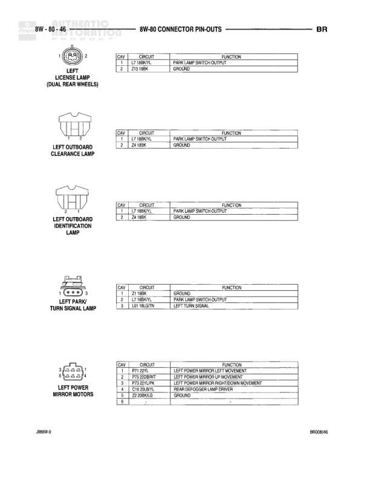

# Connector Pin-Outs

**Notes:** This diagram shows connector pin-out configurations for ignition switches and instrument clusters. Pin assignments include: Ignition Switch C1 (7 pins): IGN 10M, A31 10M, A2 10RD/BK, A22 14BK/OR, A31 10RD/WT, A1 18RD. Ignition Switch C2 (4 pins): Q75 20TN, Q88 20LB, W 22YL, M92 22YL/RD. Instrument Cluster C1 (10 pins): G88 22GY/BK, G6 20DB/WT, G11 22WT/LG, Z5 20BK/LG, P2 20WT/YL, P79 22YL, T18 22LG/OR, G88 22GY/BK, G88 22GY/BK, D7 20WT/BK. Instrument Cluster C2 (10 pins): E2 20GY, G86 22BK/WT, G10 22LG/RD, L7 18RD/YL, G41 18LG, G13 22LG/RD, Q4 22WT, G34 18PK/WT, G107 20BK/WT. Functions include ignition switch outputs, fused circuits, grounds, warning lamp drivers, and various sensor signals.

## Components

| Component | Ref | Connectors | Notes |
|-----------|-----|------------|-------|
| Ignition Switch | C1 | C1 | 7-pin connector |
| Ignition Switch | C2 | C2 | 4-pin connector |
| Instrument Cluster | C1 | C1 | 10-pin connector |
| Instrument Cluster | C2 | C2 | 10-pin connector |
