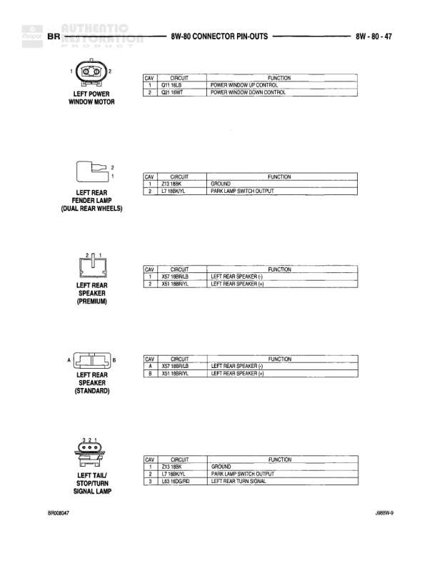

# 8W-80 CONNECTOR PIN-OUTS - BR - INTAKE AIR HEATER CONNECTORS (DIESEL)

**Notes:** This page shows connector pin-outs for diesel intake air heater system components. Document reference: XMBW-0, BR00M036

## Components

| Component | Ref | Connectors | Notes |
|-----------|-----|------------|-------|
| INTAKE AIR HEATER (DIESEL) | 8W-80-36 | 2-pin connector | Black wires on both pins |
| INTAKE AIR HEATER RELAY NO. 1 (DIESEL) | 8W-80-36 | 2-pin connector |  |
| INTAKE AIR HEATER RELAY NO. 2 (DIESEL) | 8W-80-36 | 2-pin connector |  |

## Wires

| From | To | Wire Code | Gauge | Color | Notes |
|------|-----|-----------|-------|-------|-------|
| INTAKE AIR HEATER Pin 1 | None | A82 | None | BK | FUSED B(+) |
| INTAKE AIR HEATER Pin 2 | None | A82 | None | BK | FUSED B(+) |
| INTAKE AIR HEATER RELAY NO. 1 Pin 1 | None | F29 | None | DG/OR | B FUSED B(+) |
| INTAKE AIR HEATER RELAY NO. 1 Pin 2 | None | S21 | None | BK/BK | AIS/B IAH HEATER RELAY NO. 1 CONTROL |
| INTAKE AIR HEATER RELAY NO. 2 Pin 1 | None | F29 | None | DG/OR | FUSED COIL IST-RUN |
| INTAKE AIR HEATER RELAY NO. 2 Pin 2 | None | S21 | None | BK/BK | AIS INTAKE HEATER RELAY NO. 2 CONTROL |
