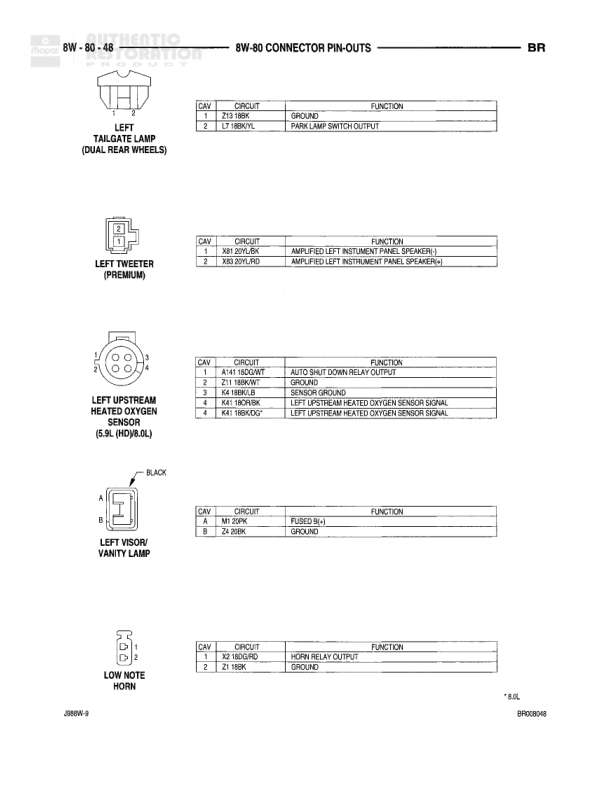

# BR - Schematics - 8W-80 Connector Pin-Outs

**Notes:** This diagram shows connector pin-out information for Intake Air Temperature Sensors (both Diesel and Gas variants) and the Integrated Electronic Control Module (Base CTM). CTM connector marked with GREEN indicator.

## Components

| Component | Ref | Connectors | Notes |
|-----------|-----|------------|-------|
| Intake Air Temperature Sensor (Diesel) | 8W-80-37 | 2-pin connector | Diesel variant |
| Intake Air Temperature Sensor (Gas) | 8W-80-37 | 2-pin connector | Gas variant |
| Integrated Electronic Control Module (Base CTM) | 8W-80-37 | 14-pin connector with GREEN indicator | Base CTM variant, Reference: BR008237, Location: J4800-9 |

## Wires

| From | To | Wire Code | Gauge | Color | Notes |
|------|-----|-----------|-------|-------|-------|
| Intake Air Temperature Sensor (Diesel) Pin A | None | K4 | None | 18BK/LB | Sensor Ground |
| Intake Air Temperature Sensor (Diesel) Pin B | None | K21 | None | 18BK/RD | Intake Air Temperature Signal |
| Intake Air Temperature Sensor (Gas) Pin A | None | K4 | None | 18BK/LB | Sensor Ground |
| Intake Air Temperature Sensor (Gas) Pin B | None | K21 | None | 18BK/RD | Intake Air Temperature Signal |
| Integrated Electronic Control Module Pin 1 | None | D10 | None | GR/L | Left Door Ajar Switch Sense |
| Integrated Electronic Control Module Pin 2 | None | V14 | None | 18WT/DG | Wiper ON/OFF |
| Integrated Electronic Control Module Pin 3 | None | V8 | None | 18VT | Intermittent Wiper Sense |
| Integrated Electronic Control Module Pin 4 | None | V18 | None | 20YL/DG | Wiper Relay |
| Integrated Electronic Control Module Pin 5 | None | D10 | None | GR/K/LB | Right Door Jamb Switch Sense |
| Integrated Electronic Control Module Pin 6 | None | Z2 | None | GR/K/LG | Ground |
| Integrated Electronic Control Module Pin 7 | None | None | None | None | Not used |
| Integrated Electronic Control Module Pin 8 | None | V4 | None | 14DB | Wiper Park Switch Feed |
| Integrated Electronic Control Module Pin 9 | None | F12 | None | 22GR/WT* | Fused Ignition (Lift Run) |
| Integrated Electronic Control Module Pin 10 | None | V5 | None | 14BR | Wiper Switch Mode Richness |
| Integrated Electronic Control Module Pin 11 | None | V10 | None | 18BR | Washer Pump Control |
| Integrated Electronic Control Module Pin 12 | None | V6 | None | 14DG | Wiper Switch Mode Sense |
| Integrated Electronic Control Module Pin 13 | None | M13 | None | 20PK/OR | Keypad Lamphouse Signal |
| Integrated Electronic Control Module Pin 14 | None | M20 | None | 22YL/RD | Key-At-Lamp Driver |
| Integrated Electronic Control Module Pin 15 | None | P3 | None | 22RD | Fused B(+) |
