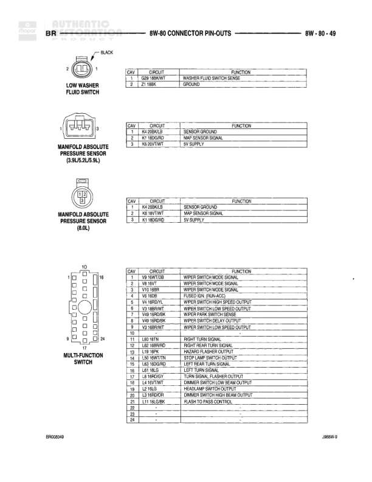

# 8W-80 CONNECTOR PIN-OUTS

**Notes:** GAS and DIESEL vehicle connector pin-outs for PDC (Power Distribution Center). Document reference: 2868W-9 and BRM00308.

## Components

| Component | Ref | Connectors | Notes |
|-----------|-----|------------|-------|
| Connector No. 1 | IN PDC | C1 | 28-pin connector |
| Connector No. 2 | IN PDC | C2 | 18-pin connector, JOINT |

## Wires

| From | To | Wire Code | Gauge | Color | Notes |
|------|-----|-----------|-------|-------|-------|
| Connector No. 1 Pin 1 | BRAKE SWITCH SENSE | V60 | 20 | PK | None |
| Connector No. 1 Pin 2 | BRAKE SWITCH SENSE | V60 | 20 | PK | None |
| Connector No. 1 Pin 3 | SENSOR RETURN | V4 | 18 | WT | None |
| Connector No. 1 Pin 4 | SENSOR RETURN | V4 | 18 | WT | None |
| Connector No. 1 Pin 5 | SENSOR RETURN | V4 | 18 | WT | None |
| Connector No. 1 Pin 6 | SENSOR RETURN | V4 | 18 | WT | None |
| Connector No. 1 Pin 7 | SENSOR RETURN | V4 | 18 | WT | None |
| Connector No. 1 Pin 8 | SENSOR RETURN | V4 | 18 | WT | None |
| Connector No. 1 Pin 9 | FUSED B(+) (ST) | L1 | 18 | GY | None |
| Connector No. 1 Pin 10 | FUSED B(+) (ST) | L1 | 18 | GY | None |
| Connector No. 1 Pin 11 | HORN RELAY OUTPUT | K2 | 20 | RD | None |
| Connector No. 1 Pin 12 | HORN RELAY OUTPUT | K2 | 20 | RD | None |
| Connector No. 1 Pin 13 | HORN RELAY OUTPUT | K2 | 20 | RD | None |
| Connector No. 1 Pin 14 | HORN RELAY OUTPUT | K2 | 20 | RD | None |
| Connector No. 1 Pin 15 | SENSOR GROUND | K4 | 20 | LB | None |
| Connector No. 1 Pin 16 | SENSOR GROUND | K4 | 20 | LB | None |
| Connector No. 1 Pin 17 | SENSOR GROUND | K4 | 20 | LB | None |
| Connector No. 1 Pin 18 | SENSOR GROUND | K4 | 20 | LB | None |
| Connector No. 1 Pin 19 | GROUND | Z1 | 22 | BK | None |
| Connector No. 1 Pin 20 | GROUND | Z1 | 22 | BK | None |
| Connector No. 1 Pin 21 | GROUND | Z1 | 22 | BK | None |
| Connector No. 1 Pin 22 | GROUND | Z1 | 18 | BK | None |
| Connector No. 1 Pin 23 | GROUND | Z1 | 20 | BK | None |
| Connector No. 1 Pin 24 | GROUND | Z1 | 20 | BK | None |
| Connector No. 1 Pin 25 | GROUND | Z1 | 20 | BK | None |
| Connector No. 1 Pin 26 | None | None | None | None | Not used |
| Connector No. 1 Pin 27 | GROUND | Z1 | 18 | BK | None |
| Connector No. 1 Pin 28 | GROUND | Z1 | 18 | BK | None |
| Connector No. 2 Pin 1 | FUSED B(+) | A2 | 14 | PK | None |
| Connector No. 2 Pin 2 | FUSED B(+) | A2 | 14 | PK | None |
| Connector No. 2 Pin 3 | FUSED B(+) | A2 | 14 | PK | None |
| Connector No. 2 Pin 4 | WIPER SWITCH CLOSE SENSE | V5 | 18 | DG | None |
| Connector No. 2 Pin 5 | WIPER SWITCH OPEN SENSE | V5 | 18 | DG | None |
| Connector No. 2 Pin 6 | CIGAR LIGHTER OUTPUT | P60 | 14 | RD | None |
| Connector No. 2 Pin 7 | AUTO SHUT DOWN RELAY OUTPUT | A14L | 14 | DGIOR | None |
| Connector No. 2 Pin 8 | STARTER RELAY OUTPUT | K60 | 14 | RDYT | None |
| Connector No. 2 Pin 9 | STARTER RELAY OUTPUT | A14L | 14 | DGIOR | None |
| Connector No. 2 Pin 10 | STARTER RELAY OUTPUT | K60 | 14 | RDYT | None |
| Connector No. 2 Pin 11 | AUTO SHUT DOWN RELAY OUTPUT | A14L | 14 | DGIOR | None |
| Connector No. 2 Pin 12 | FUSED B(+) | A14 | 10 | RDWT | None |
| Connector No. 2 Pin 13 | FUSED B(+) | A14 | 10 | RDWT | None |
| Connector No. 2 Pin 14 | FUSED B(+) | A14 | 10 | RDWT | None |
| Connector No. 2 Pin 15 | FUSED B(+) | A14 | 10 | RDWT | None |
| Connector No. 2 Pin 16 | FUSED B(+) | A6 | 12 | RDOR | None |
| Connector No. 2 Pin 17 | FUSED B(+) | A6 | 12 | RDOR | None |
| Connector No. 2 Pin 18 | FUSED B(+) | A6 | 12 | RDOR | None |
