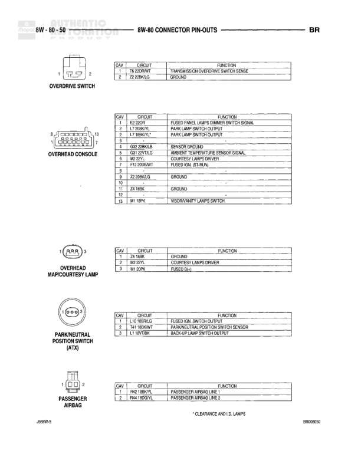

# CONNECTOR PIN-OUTS

**Notes:** This diagram shows connector pin-out information for three joint connectors. Connector No. 3 is a 4-pin connector, Connector No. 4 is an 8-pin connector, and Connector No. 5 is a 22-pin connector. The diagram includes circuit assignments, wire colors, and functions for each pin.

## Components

| Component | Ref | Connectors | Notes |
|-----------|-----|------------|-------|
| JOINT CONNECTOR NO. 3 | 8W-80-39 | C | 4-pin connector |
| JOINT CONNECTOR NO. 4 | 8W-80-39 | C | 8-pin connector |
| JOINT CONNECTOR NO. 5 | 8W-80-39 | C | 22-pin connector |

## Wires

| From | To | Wire Code | Gauge | Color | Notes |
|------|-----|-----------|-------|-------|-------|
| JOINT CONNECTOR NO. 3 | Pin 1 | Z1 | None | BK | GROUND |
| JOINT CONNECTOR NO. 3 | Pin 2 | Z1 | None | BK | GROUND |
| JOINT CONNECTOR NO. 3 | Pin 3 | G157 | None | GY/WT | 4WD SENSE |
| JOINT CONNECTOR NO. 3 | Pin 4 | G157 | None | GY/WT | 4WD SENSE |
| JOINT CONNECTOR NO. 3 | Pin 5 | Z1 | None | BK | GROUND |
| JOINT CONNECTOR NO. 3 | Pin 6 | G157 | None | GY/WT | 4WD SENSE |
| JOINT CONNECTOR NO. 4 | Pin 1 | Z1 | None | BK | GROUND |
| JOINT CONNECTOR NO. 4 | Pin 2 | Z1 | None | BK | GROUND |
| JOINT CONNECTOR NO. 4 | Pin 3 | Z1 | None | BK | GROUND |
| JOINT CONNECTOR NO. 4 | Pin 4 | Z1 | None | BK | GROUND |
| JOINT CONNECTOR NO. 4 | Pin 5 | Z1 | None | BK | GROUND |
| JOINT CONNECTOR NO. 4 | Pin 6 | Z1 | None | BK | GROUND |
| JOINT CONNECTOR NO. 4 | Pin 7 | Z1 | None | BK | GROUND |
| JOINT CONNECTOR NO. 4 | Pin 8 | Z1 | None | BK | GROUND |
| JOINT CONNECTOR NO. 5 | Pin 1 | Z3 | None | BK/OR | GROUND |
| JOINT CONNECTOR NO. 5 | Pin 2 | Z3 | None | BK/OR | GROUND |
| JOINT CONNECTOR NO. 5 | Pin 3 | Z3 | None | BK/OR | GROUND |
| JOINT CONNECTOR NO. 5 | Pin 5 | M1 | None | DG/PK | FUSED B(+) |
| JOINT CONNECTOR NO. 5 | Pin 6 | M1 | None | DG/PK | FUSED B(+) |
| JOINT CONNECTOR NO. 5 | Pin 7 | M1 | None | DG/PK | FUSED B(+) |
| JOINT CONNECTOR NO. 5 | Pin 8 | E2 | None | RD/R | PANEL LAMPS FEED |
| JOINT CONNECTOR NO. 5 | Pin 9 | E2 | None | RD/R | PANEL LAMPS FEED |
| JOINT CONNECTOR NO. 5 | Pin 11 | Z3 | None | BK/OR | GROUND |
| JOINT CONNECTOR NO. 5 | Pin 12 | Z3 | None | BK/OR | GROUND |
| JOINT CONNECTOR NO. 5 | Pin 13 | Z3 | None | BK/OR | GROUND |
| JOINT CONNECTOR NO. 5 | Pin 14 | M1 | None | DG/PK | FUSED B(+) |
| JOINT CONNECTOR NO. 5 | Pin 15 | M1 | None | DG/PK | FUSED B(+) |
| JOINT CONNECTOR NO. 5 | Pin 16 | M1 | None | DG/PK | FUSED B(+) |
| JOINT CONNECTOR NO. 5 | Pin 20 | E2 | None | RD/R | PANEL LAMPS FEED |
| JOINT CONNECTOR NO. 5 | Pin 21 | E2 | None | RD/R | PANEL LAMPS FEED |
| JOINT CONNECTOR NO. 5 | Pin 22 | E2 | None | RD/R | PANEL LAMPS FEED |
