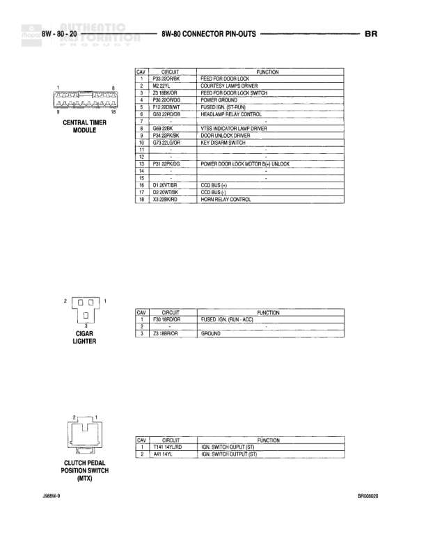

# 8W - 80 CONNECTOR PIN-OUTS - BR

**Notes:** This is an index/reference page (8W-80-4) listing connector pin-out locations for various components. It does not contain actual wiring diagram information, but rather references to other pages where the detailed pin-out information can be found.

## Components

| Component | Ref | Connectors | Notes |
|-----------|-----|------------|-------|
| Radio C1 | 8W-80-61 |  |  |
| Radio C2 | 8W-80-61 |  |  |
| Radio C3 | 8W-80-61 |  |  |
| Rear Cigar/Seat Motor | 8W-80-62 |  |  |
| Rear Window Defroster | 8W-80-62 |  |  |
| Right Back-Up Lamp | 8W-80-62 |  |  |
| Right Door Dimming Switch | 8W-80-62 |  |  |
| Right Door Jamb Switch | 8W-80-62 |  |  |
| Right Door Lock Motor | 8W-80-63 |  |  |
| Right Door Module | 8W-80-63 |  |  |
| Right Fog Lamp | 8W-80-63 |  |  |
| Right Front Door Speaker | 8W-80-63 |  |  |
| Right Front Fender Lamp | 8W-80-63 |  |  |
| Right Front Wheel Speed Sensor | 8W-80-64 |  |  |
| Right Headlamp | 8W-80-64 |  |  |
| Right License Lamp | 8W-80-64 |  |  |
| Right Outboard Clearance Lamp | 8W-80-64 |  |  |
| Right Outboard Identification Lamp | 8W-80-64 |  |  |
| Right Park/Turn Signal Lamp | 8W-80-64 |  |  |
| Right Power Mirror Motors | 8W-80-65 |  |  |
| Right Power Window Motor | 8W-80-65 |  |  |
| Right Rear Fender Lamp | 8W-80-65 |  |  |
| Right Rear Speaker | 8W-80-65 |  |  |
| Right Stop/Park/Turn Signal Lamp | 8W-80-65 |  |  |
| Right Tailgate Lamp | 8W-80-66 |  |  |
| Right Travel Lamp | 8W-80-66 |  |  |
| Right Upstream Heated Oxygen Sensor | 8W-80-66 |  |  |
| Right View/Vanity Lamp | 8W-80-66 |  |  |
| Seatbelt Control Module | 8W-80-67 |  |  |
| Seatbelt Switch | 8W-80-67 |  |  |
| Sun Visor Mirror Lamp | 8W-80-67 |  |  |
| Throttle Position Sensor | 8W-80-67 |  |  |
| Trailer Tow Connector | 8W-80-68 |  |  |
| Transmission Output Shaft Speed Sensor | 8W-80-68 |  |  |
| Transmission Solenoid Assembly | 8W-80-68 |  |  |
| Transfer Case Module | 8W-80-68 |  |  |
| Upstream Heated Oxygen Sensor | 8W-80-69 |  |  |
| Vehicle Speed Control Servo | 8W-80-69 |  |  |
| Vehicle Speed Control/Horn Switch | 8W-80-69 |  |  |
| Windshield Washer Pump Motor | 8W-80-70 |  |  |
| Wiper Motor | 8W-80-70 |  |  |

## Cross-References

- 8W-80-61
- 8W-80-62
- 8W-80-63
- 8W-80-64
- 8W-80-65
- 8W-80-66
- 8W-80-67
- 8W-80-68
- 8W-80-69
- 8W-80-70
