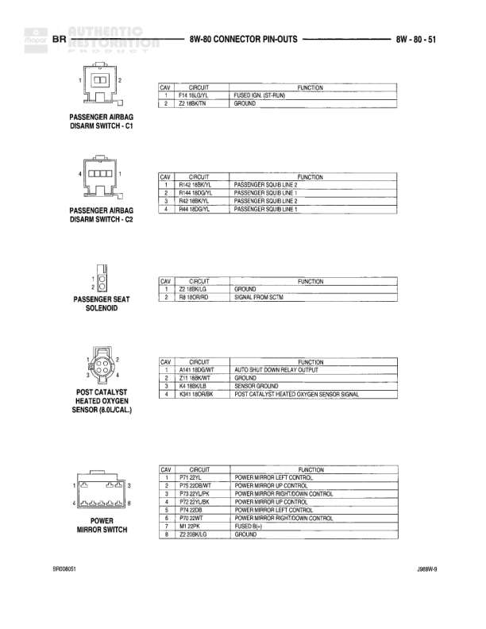

# 8W-80 Connector Pin-Outs - BR

**Notes:** This diagram shows connector pin-out tables for Joint Connectors No. 6 and 7, listing circuit functions, wire codes, and colors. Pin assignments 16-17 for Connector 6 and pins 17-22 for Connector 7 are not used/vacant.

## Components

| Component | Ref | Connectors | Notes |
|-----------|-----|------------|-------|
| Joint Connector No. 6 | 8W-80-40 | C6 | 22-pin connector with functions for lighting, switches, and relay controls |
| Joint Connector No. 7 | 8W-80-40 | C7 | 22-pin connector with CDQ BUS functions |

## Wires

| From | To | Wire Code | Gauge | Color | Notes |
|------|-----|-----------|-------|-------|-------|
| Joint Connector No. 6 Pin 1 | SD TRANSM'T | D61 | None | DG/PK | CIRCUIT |
| Joint Connector No. 6 Pin 2 | SD TRANSM'T | D61 | None | DG/PK | CIRCUIT |
| Joint Connector No. 6 Pin 3 | SD TRANSM'T | D61 | None | DG/PK/BR | CIRCUIT |
| Joint Connector No. 6 Pin 4 | LEFT DOOR AJAR SWITCH SENSE | Q25 | None | 22TN | CIRCUIT |
| Joint Connector No. 6 Pin 5 | COURTESY LAMP SWITCH OUTPUT | M2 | None | 22VT | CIRCUIT |
| Joint Connector No. 6 Pin 6 | COURTESY LAMP SWITCH OUTPUT | M2 | None | 22VT | CIRCUIT |
| Joint Connector No. 6 Pin 7 | COURTESY LAMP SWITCH OUTPUT | M2 | None | 22VT/L | CIRCUIT |
| Joint Connector No. 6 Pin 8 | KEY-IN LOCK SWITCH SENSE | Q26 | None | 22LB | CIRCUIT |
| Joint Connector No. 6 Pin 9 | KEY-IN LOCK SWITCH SENSE | Q26 | None | 22LB | CIRCUIT |
| Joint Connector No. 6 Pin 10 | PARKING BRAKE SWITCH SENSE | Q11 | None | 20WT/LG | CIRCUIT |
| Joint Connector No. 6 Pin 11 | PARKING BRAKE SWITCH SENSE | Q11 | None | 20WT/LG | CIRCUIT |
| Joint Connector No. 6 Pin 12 | PARKING BRAKE SWITCH SENSE | Q11 | None | 20WT/LG | CIRCUIT |
| Joint Connector No. 6 Pin 13 | LEFT DOOR AJAR SWITCH SENSE | Q25 | None | 22TN | CIRCUIT |
| Joint Connector No. 6 Pin 14 | LEFT DOOR AJAR SWITCH SENSE | Q25 | None | 22TN | CIRCUIT |
| Joint Connector No. 6 Pin 15 | LEFT DOOR AJAR SWITCH SENSE | Q25 | None | 22TN | CIRCUIT |
| Joint Connector No. 6 Pin 18 | COURTESY LAMP SWITCH OUTPUT | M2 | None | 22VT/L | CIRCUIT |
| Joint Connector No. 6 Pin 19 | COURTESY LAMP SWITCH OUTPUT | M2 | None | 22VT/L | CIRCUIT |
| Joint Connector No. 6 Pin 20 | HORN RELAY CONTROL | X3 | None | 22BK/RD | CIRCUIT |
| Joint Connector No. 6 Pin 21 | HORN RELAY CONTROL | X3 | None | 22BK/RD | CIRCUIT |
| Joint Connector No. 6 Pin 22 | HORN RELAY CONTROL | X3 | None | 22BK/RD | CIRCUIT |
| Joint Connector No. 7 Pin 1 | CDQ BUS(+) | D1 | None | 18VT/BR | CIRCUIT |
| Joint Connector No. 7 Pin 2 | CDQ BUS(+) | D1 | None | 18VT/BR | CIRCUIT |
| Joint Connector No. 7 Pin 3 | CDQ BUS(-) | D1 | None | 20VT/BR | CIRCUIT |
| Joint Connector No. 7 Pin 4 | CDQ BUS(-) | D2 | None | 16WT/BK | CIRCUIT |
| Joint Connector No. 7 Pin 5 | CDQ BUS(-) | D2 | None | 16WT/BK | CIRCUIT |
| Joint Connector No. 7 Pin 6 | CDQ BUS(-) | D2 | None | 20WT/BK | CIRCUIT |
| Joint Connector No. 7 Pin 7 | CDQ BUS(-) | D2 | None | 20WT/BK | CIRCUIT |
| Joint Connector No. 7 Pin 8 | CDQ BUS(+) | D1 | None | 20VT/BR | CIRCUIT |
| Joint Connector No. 7 Pin 9 | CDQ BUS(+) | D1 | None | 20VT/BR | CIRCUIT |
| Joint Connector No. 7 Pin 10 | CDQ BUS(+) | D1 | None | 20VT/BR | CIRCUIT |
| Joint Connector No. 7 Pin 11 | CDQ BUS(+) | D1 | None | 20VT/BR | CIRCUIT |
| Joint Connector No. 7 Pin 12 | CDQ BUS(+) | D1 | None | 20VT/BR | CIRCUIT |
| Joint Connector No. 7 Pin 13 | CDQ BUS(-) | D2 | None | 20WT/BK | CIRCUIT |
| Joint Connector No. 7 Pin 14 | CDQ BUS(-) | D2 | None | 20WT/BK | CIRCUIT |
| Joint Connector No. 7 Pin 15 | CDQ BUS(-) | D2 | None | 20WT/BK | CIRCUIT |
| Joint Connector No. 7 Pin 16 | CDQ BUS(-) | D2 | None | 20WT/BK | CIRCUIT |
