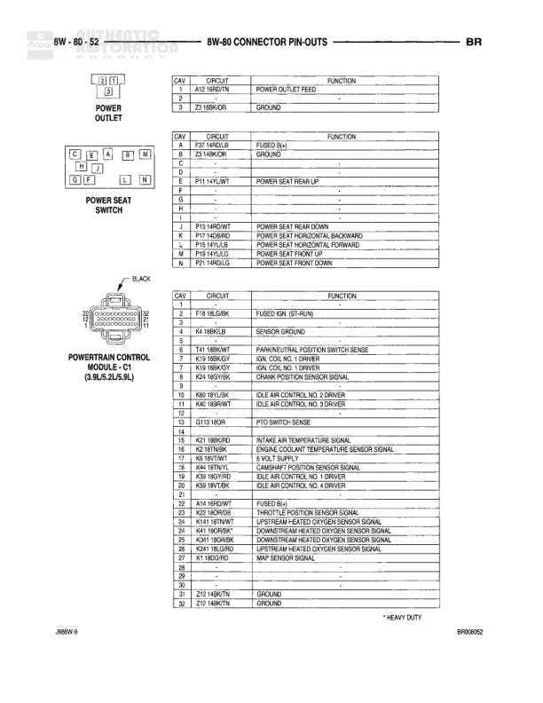

# 8W-80 CONNECTOR PIN-OUTS

**Notes:** CLEARANCE AND ID LAMPS. This page shows junction block connector pin-outs for connectors C1, C2, and C3. C2 is Natural colored. Document references BR00041 and 28BW-9.

## Components

| Component | Ref | Connectors | Notes |
|-----------|-----|------------|-------|
| Junction Block C1 | 8W-80-41 | C1 | 16-pin junction block connector |
| Junction Block C2 | 8W-80-41 | C2 | 5-pin junction block connector, Natural colored |
| Junction Block C3 | 8W-80-41 | C3 | 14-pin junction block connector |

## Wires

| From | To | Wire Code | Gauge | Color | Notes |
|------|-----|-----------|-------|-------|-------|
| Junction Block C1 Pin 1 | None | G21 | None | None | DOOR LATCH SWITCH SENSE |
| Junction Block C1 Pin 2 | None | D5 | 20 | WT/DG | VEHICLE TEMPERATURE SENSOR SIGNAL |
| Junction Block C1 Pin 3 | None | A20 | None | RD/OR | FUSED B(+) |
| Junction Block C1 Pin 4 | None | L27 | 18 | LG | LEFT TURN SIGNAL |
| Junction Block C1 Pin 5 | None | V8 | 16 | DB | FUSED IGN. RUN/ACC |
| Junction Block C1 Pin 6 | None | None | None | None |  |
| Junction Block C1 Pin 7 | None | None | None | None |  |
| Junction Block C1 Pin 8 | None | L7 | 18 | BR/YL | PARK LAMP RELAY OUTPUT |
| Junction Block C1 Pin 9 | None | V8 | 16 | DB | FUSED IGN. RUN/ACC |
| Junction Block C1 Pin 10 | None | L1 | 18 | RD/BK | BACK-UP LAMP FEED |
| Junction Block C1 Pin 11 | None | V8 | 16 | DB | FUSED IGN. RUN/ACC |
| Junction Block C1 Pin 12 | None | V8 | 16 | DB | FUSED IGN. RUN/ACC |
| Junction Block C1 Pin 13 | None | G32 | None | DB/WT | SENSOR GROUND |
| Junction Block C2 Pin 1 | None | L37 | 18 | BR | RUN/START |
| Junction Block C2 Pin 2 | None | L8 | 18 | RD/WT | TURBO FLASHER FEED |
| Junction Block C2 Pin 3 | None | M7 | 20 | PK | FUSED B(+) |
| Junction Block C2 Pin 4 | None | M1 | 20 | PK | FUSED B(+) |
| Junction Block C2 Pin 5 | None | L96 | 18 | TN | RIGHT TURN SIGNAL |
| Junction Block C3 Pin 1 | None | G28 | 20 | BK/LB | SENSOR GROUND |
| Junction Block C3 Pin 2 | None | Z2 | 20 | BK/LB | GROUND |
| Junction Block C3 Pin 3 | None | M2 | 20 | YL | COURTESY LAMP DRIVER |
| Junction Block C3 Pin 4 | None | None | None | None |  |
| Junction Block C3 Pin 5 | None | G31 | 22 | VT/LG | A/C BLOWER MODULE (-) |
| Junction Block C3 Pin 6 | None | M1 | 20 | PK | FUSED B(+) |
| Junction Block C3 Pin 7 | None | None | None | None |  |
| Junction Block C3 Pin 8 | None | L7 | 18 | BR/YL | PARK LAMP RELAY OUTPUT |
| Junction Block C3 Pin 9 | None | L7 | 20 | BR/YL | PARK LAMP RELAY OUTPUT |
| Junction Block C3 Pin 10 | None | E2 | 20 | OR | PANEL LAMPS FEED |
| Junction Block C3 Pin 11 | None | None | None | None |  |
| Junction Block C3 Pin 12 | None | L1 | 18 | RD/BK | BACK-UP LAMP FEED |
| Junction Block C3 Pin 13 | None | X4 | None | DG | GROUND |
| Junction Block C3 Pin 14 | None | L14 | 20 | BR/WT | FUSED IGN. (AT-RUN) |

## Cross-References

- 8W-80
