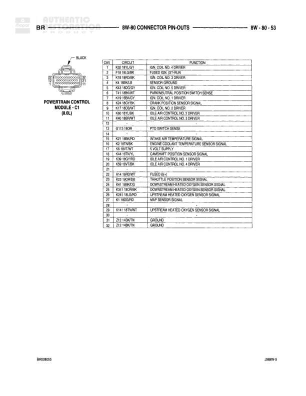

# 8W-80 CONNECTOR PIN-OUTS - BR

**Notes:** Pin-out reference table for Junction Blocks C4, C5, C6, and C7 showing cavity numbers, circuit designations, and functions. Document reference: A666W-5, BR90000-02

## Components

| Component | Ref | Connectors | Notes |
|-----------|-----|------------|-------|
| Junction Block C4 | 8W-80-42 | C4 | 11-pin junction block connector |
| Junction Block C5 | 8W-80-42 | C5 | 8-pin junction block connector |
| Junction Block C6 | 8W-80-42 | C6 | 6-pin junction block connector |
| Junction Block C7 | 8W-80-42 | C7 | 13-pin junction block connector |

## Wires

| From | To | Wire Code | Gauge | Color | Notes |
|------|-----|-----------|-------|-------|-------|
| Junction Block C4 Pin 1 | None | F31 | None | BL/OR | FUSED IGNITION (RUN/ACC) |
| Junction Block C4 Pin 2 | None | F33 | 14 | RD/BK | FUSED IGNITION (START/RUN) |
| Junction Block C4 Pin 3 | None | K12 | 14 | DB/WT | FUSED IGNITION (RUN/ACC) |
| Junction Block C4 Pin 4 | None | L91 | 18 | LG | LEFT TURN SIGNAL |
| Junction Block C4 Pin 5 | None | F12 | 20 | DB/WT | FUSED IGNITION (START/RUN) |
| Junction Block C4 Pin 6 | None | F13 | 20 | DB/WT | FUSED IGNITION (START/RUN) |
| Junction Block C4 Pin 7 | None | F13 | 20 | DB/WT | FUSED IGNITION (START/RUN) |
| Junction Block C4 Pin 8 | None | E1 | 18 | TN | PANEL LAMPS DIMMER SWITCH SIGNAL |
| Junction Block C5 Pin 1 | None | K12 | 14 | DB/WT | FUSED IGNITION (RUN/ACC) |
| Junction Block C5 Pin 2 | None | L91 | 18 | LG | LEFT TURN SIGNAL |
| Junction Block C5 Pin 3 | None | Q6 | None | RD/DG | RADIO 12 VOLT SUPPLY |
| Junction Block C5 Pin 4 | None | V6 | 14 | DB | FUSED IGNITION (RUN/ACC) |
| Junction Block C5 Pin 6 | None | M2 | 12 | YL | COURTESY LAMPS SWITCH OUTPUT |
| Junction Block C5 Pin 7 | None | E2 | 20 | OR | FUSED PANEL LAMPS DIMMER SWITCH SIGNAL |
| Junction Block C5 Pin 8 | None | Q5 | 20 | DB/WT | FUSED IGNITION (START/RUN) |
| Junction Block C6 Pin 1 | None | F33 | 14 | PK/RD | FUSED IGNITION (START/RUN) |
| Junction Block C6 Pin 4 | None | L13 | 18 | PK | HAZARD FLASHER SIGNAL |
| Junction Block C6 Pin 6 | None | L13 | 18 | BR/LG | BACKUP LAMP FEED |
| Junction Block C7 Pin 1 | None | L90 | 18 | TN | RIGHT TURN SIGNAL |
| Junction Block C7 Pin 3 | None | Z1 | 18 | BK/WT | GROUND |
| Junction Block C7 Pin 4 | None | L90 | 18 | TN | RIGHT TURN SIGNAL |
| Junction Block C7 Pin 5 | None | L7 | 18 | BK/YL | PARK LAMP RELAY OUTPUT |
| Junction Block C7 Pin 6 | None | L7 | 18 | BK/YL | PARK LAMP RELAY OUTPUT |
| Junction Block C7 Pin 8 | None | Z7 | 20 | BK/LG | GROUND |
| Junction Block C7 Pin 9 | None | M3 | 22 | BK | FUSED (B+) |
| Junction Block C7 Pin 10 | None | M3 | 22 | BK | FUSED (B+) |
| Junction Block C7 Pin 11 | None | F35 | 22 | RD | FUSED (B+) |
| Junction Block C7 Pin 13 | None | L8 | 18 | RD/WT | FLASHER OUTPUT |
