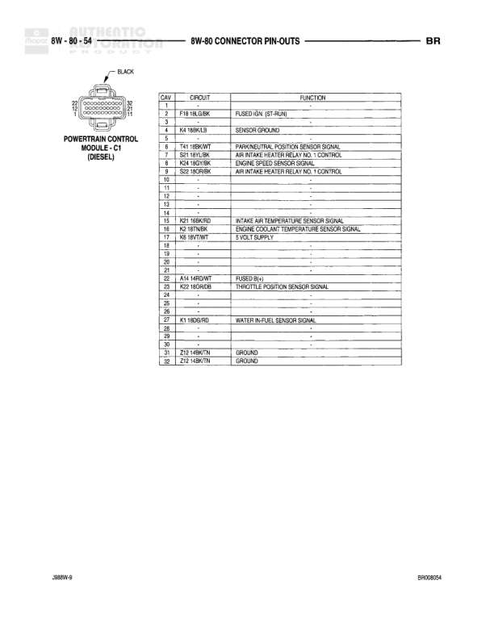

# 8W-80 CONNECTOR PIN-OUTS

**Notes:** This is a connector pin-out reference page showing pin assignments for various connectors in the 8W-80 section. Document reference 8W94063 at bottom right.

## Components

| Component | Ref | Connectors | Notes |
|-----------|-----|------------|-------|
| Junction Block - C8 | 8W-80-43 | C8 | 8-pin junction block |
| Junction Block - C9 | 8W-80-43 | C9 | 4-pin junction block |
| Leak Detection Pump | 8W-80-43 | 4-pin connector | Evaporative emissions system component |
| Left Back-Up Lamp | 8W-80-43 | 2-pin connector | Rear lighting |
| Left Door Disarm Switch | 8W-80-43 | 2-pin connector | Security system switch, Part of 8W94063 |

## Wires

| From | To | Wire Code | Gauge | Color | Notes |
|------|-----|-----------|-------|-------|-------|
| Junction Block C8 - Pin 1 | F32 VIO/DOR | F32 | None | VT/OR | FUSED IGN. RUN (ACC) |
| Junction Block C8 - Pin 2 | F33 WH/LB | F33 | None | WT/LB | FUSED IGN. RUN (ACC) |
| Junction Block C8 - Pin 3 | F29 KO/YL | F29 | None | PK/YL | FUSED IGN. (ST-RUN) |
| Junction Block C8 - Pin 6 | F27 VIO/GY/LB | F27 | None | VT/GY/LB | FUSED REAR AMP SWITCH OUTPUT |
| Junction Block C8 - Pin 8 | F31 RD/TN | F31 | None | RD/TN | FUSED IGN. (PLAN) |
| Junction Block C9 - Pin 1 | A20 YL/BK/WT | A20 | None | YL/BK/WT | IGR. SWITCH OUTPUT (RUN-ACC) |
| Junction Block C9 - Pin 2 | A21 YL/DB | A21 | None | YL/DB | IGR. SWITCH OUTPUT (ST-Run) |
| Junction Block C9 - Pin 3 | F30 YL/TN | F30 | None | YL/TN | FUSED IGN. (PLAN) |
| Junction Block C9 - Pin 4 | F35 HL/BK | F35 | None | WT/BK | FUSED IGN. (PLAN) |
| Leak Detection Pump - Pin 1 | F12 OR/BK/WT | F12 | None | OR/BK/WT | FUSED IGN. (ST-RUN) |
| Leak Detection Pump - Pin 2 | K138 WT/YL/DG | K138 | None | WT/YL/DG | LEAK DETECTION PUMP SOLENOID CONTROL |
| Leak Detection Pump - Pin 4 | K107 RD/LB | K107 | None | RD/LB | LEAK DETECTION PUMP SWITCH SENSE |
| Left Back-Up Lamp - Pin 1 | K23 WH/C | K23 | None | WT | GROUND |
| Left Back-Up Lamp - Pin 2 | L11 RD/PK/L | L11 | None | RD/PK | BACK-UP LAMPS FEED |
| Left Door Disarm Switch - Pin 1 | Z2 BR/KO/D | Z2 | None | BR/PK | GROUND |
| Left Door Disarm Switch - Pin 2 | D73 GY/LB/DR | D73 | None | GY/LB/OR | LEFT DOOR KEY CYLINDER SWITCH SENSE |
