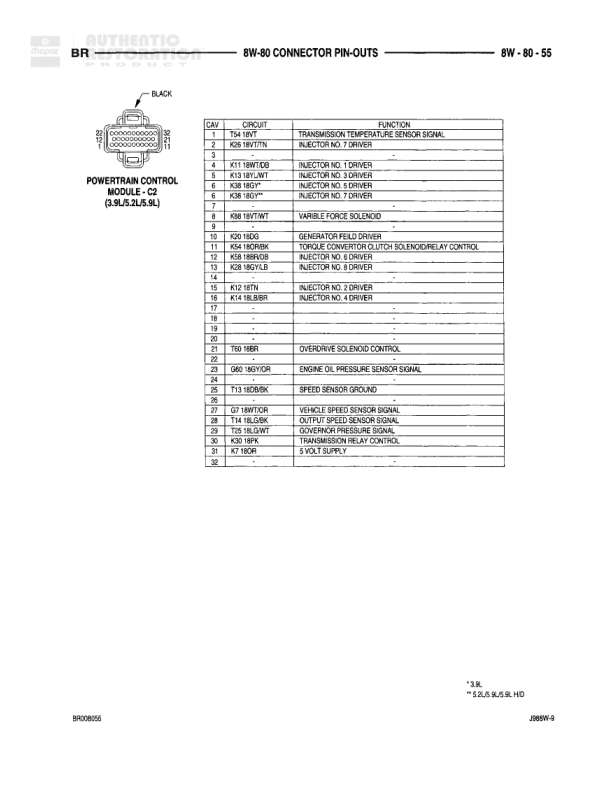

# 8W-80 CONNECTOR PIN-OUTS

**Notes:** This diagram shows connector pin-outs for various left side components including speakers, lamps, and sensors. Premium and standard speaker configurations are shown separately. Dual rear wheel configuration includes additional fender lamp.

## Components

| Component | Ref | Connectors | Notes |
|-----------|-----|------------|-------|
| LEFT FRONT DOOR SPEAKER | PREMIUM | 6-pin connector | Premium audio system |
| LEFT FRONT DOOR SPEAKER | STANDARD | 2-pin connector | Standard audio system |
| LEFT FRONT FENDER LAMP | DUAL REAR WHEELS | 2-pin connector | Dual rear wheels only |
| LEFT FRONT WHEEL SPEED SENSOR | ABS | 2-pin connector | ABS system |
| LEFT HEADLAMP |  | 4-pin connector | BLUE wire noted |
| LEFT LICENSE LAMP |  | 2-pin connector |  |

## Wires

| From | To | Wire Code | Gauge | Color | Notes |
|------|-----|-----------|-------|-------|-------|
| LEFT FRONT DOOR SPEAKER (PREMIUM) | Pin A | X5 | 20 | GY/WT | LEFT FRONT SPEAKER (-) |
| LEFT FRONT DOOR SPEAKER (PREMIUM) | Pin B | X5 | 20 | RD/WT | AMP ON |
| LEFT FRONT DOOR SPEAKER (PREMIUM) | Pin C | X5 | 20 | LG/RD | AMP ON LEFT INSTRUMENT PANEL (-) |
| LEFT FRONT DOOR SPEAKER (PREMIUM) | Pin D | X5 | 18 | BR/RD | LEFT FRONT SPEAKER (-) |
| LEFT FRONT DOOR SPEAKER (PREMIUM) | Pin E | X13 | 18 | BR/DG | RADIO CODE OUTPUT |
| LEFT FRONT DOOR SPEAKER (PREMIUM) | Pin F | X5 | 20 | GY/OR | AMP ON LEFT INSTRUMENT PANEL (-) |
| LEFT FRONT DOOR SPEAKER (STANDARD) | Pin A | X5 | 18 | BR/RD | LEFT DOOR SPEAKER (-) |
| LEFT FRONT DOOR SPEAKER (STANDARD) | Pin B | X53 | 18 | DG | LEFT DOOR SPEAKER (+) |
| LEFT FRONT FENDER LAMP (DUAL REAR WHEELS) | Pin 1 | Z13 | 18 | BK | GROUND |
| LEFT FRONT FENDER LAMP (DUAL REAR WHEELS) | Pin 2 | L7 | 18 | OR/YL | PARK LAMP SWITCH OUTPUT |
| LEFT FRONT WHEEL SPEED SENSOR (ABS) | Pin 1 | S8 | 20 | DB/WT | LEFT FRONT WHEEL SPEED SENSOR (-) |
| LEFT FRONT WHEEL SPEED SENSOR (ABS) | Pin 2 | S9 | 20 | RD | LEFT FRONT WHEEL SPEED SENSOR (+) |
| LEFT HEADLAMP | Pin A | Z1 | 20 | BK | GROUND |
| LEFT HEADLAMP | Pin B | L4 | 14 | WT/WT | DIMMER SWITCH LOW BEAM OUTPUT |
| LEFT HEADLAMP | Pin C | L3 | 14 | RD/GY | DIMMER SWITCH HIGH BEAM OUTPUT |
| LEFT LICENSE LAMP | Pin 1 | Z13 | 18 | BK | GROUND |
| LEFT LICENSE LAMP | Pin 2 | L7 | 18 | OR/YL | PARK LAMP SWITCH OUTPUT |
