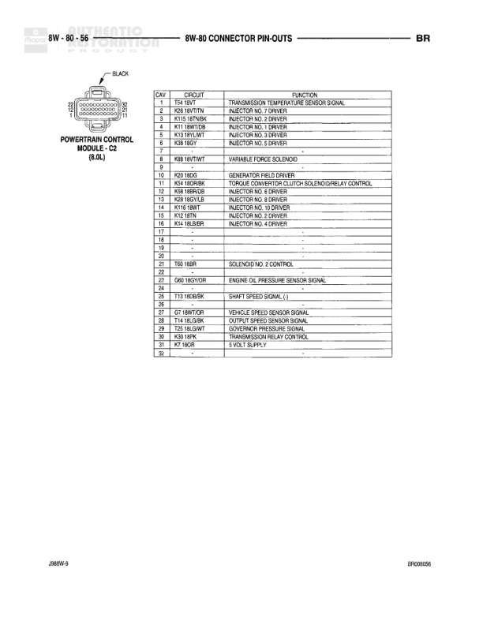

# Connector Pin-Outs

**Notes:** This is a connector pin-out reference page showing the pin assignments for various left side exterior lamps and the left power mirror motors. The page number is J8WW-9 and BR0408/46.

## Components

| Component | Ref | Connectors | Notes |
|-----------|-----|------------|-------|
| Left License Lamp (Dual Rear Wheels) | 8W-80-46 | 2-pin connector | Round connector with 2 pins |
| Left Outboard Clearance Lamp | 8W-80-46 | 2-pin connector | Rectangular lamp connector |
| Left Cab Identification Lamp | 8W-80-46 | 2-pin connector | Rectangular lamp connector |
| Left Park/Turn Signal Lamp | 8W-80-46 | 3-pin connector | Rectangular connector with 3 pins |
| Left Power Mirror Motors | 8W-80-46 | 6-pin connector | Rectangular connector with 6 pins |

## Wires

| From | To | Wire Code | Gauge | Color | Notes |
|------|-----|-----------|-------|-------|-------|
| Left License Lamp Pin 1 | Park Lamp Switch Output | L7 | 18 | BR/YL | Dual rear wheels |
| Left License Lamp Pin 2 | Ground | Z13 | 18 | BK | Dual rear wheels |
| Left Outboard Clearance Lamp Pin 1 | Park Lamp Switch Output | L7 | 18 | BR/YL |  |
| Left Outboard Clearance Lamp Pin 2 | Ground | Z4 | 18 | BK |  |
| Left Cab Identification Lamp Pin 1 | Park Lamp Switch Output | L7 | 18 | BR/YL |  |
| Left Cab Identification Lamp Pin 2 | Ground | Z4 | 18 | BK |  |
| Left Park/Turn Signal Lamp Pin 1 | Ground | Z4 | 18 | BK |  |
| Left Park/Turn Signal Lamp Pin 2 | Park Lamp Switch Output | L7 | 18 | BR/YL |  |
| Left Park/Turn Signal Lamp Pin 3 | Left Turn Signal | L61 | 18 | YL/TN |  |
| Left Power Mirror Motors Pin 1 | Left Power Mirror Left/Right Movement | P73 | 20 | GY/YL |  |
| Left Power Mirror Motors Pin 2 | Left Power Mirror Left/Right Movement | P73 | 20 | BR/WT |  |
| Left Power Mirror Motors Pin 3 | Left Power Mirror Up/Right Down Movement | P73 | 20 | LG/YL |  |
| Left Power Mirror Motors Pin 4 | Rear Defogger Lamp Switch | C3 | 22 | YL/BL |  |
| Left Power Mirror Motors Pin 5 | Ground | Z2 | 20 | GY/LG |  |
| Left Power Mirror Motors Pin 6 | Ground |  | None |  | Pin 6 shown but no circuit specified |
