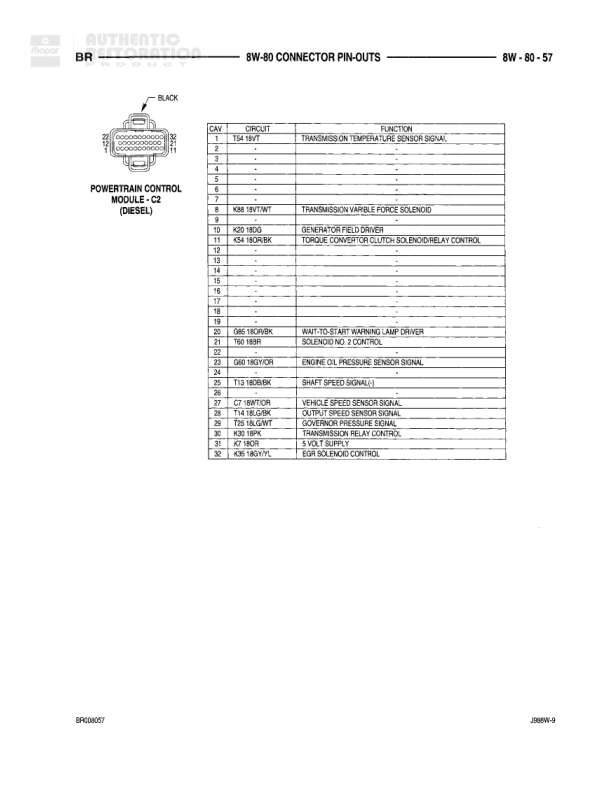

# Connector Pin-Outs

**Notes:** This page shows connector pin-out information for left side components including power window motor, rear fender lamp (dual rear wheels), rear speakers (standard and premium), and tail/stop/turn signal lamp. Document identifiers shown: 8B008D47 and 2B6W-9

## Components

| Component | Ref | Connectors | Notes |
|-----------|-----|------------|-------|
| LEFT POWER WINDOW MOTOR | 8W-80-47 | 2-pin connector | 2-cavity connector |
| LEFT REAR FENDER LAMP (DUAL REAR WHEELS) | 8W-80-47 | 2-pin connector | 2-cavity connector |
| LEFT REAR SPEAKER (PREMIUM) | 8W-80-47 | 2-pin connector | 2-cavity connector |
| LEFT REAR SPEAKER (STANDARD) | 8W-80-47 | 2-pin connector | 2-cavity connector with cavities A and B |
| LEFT TAIL/STOP/TURN SIGNAL LAMP | 8W-80-47 | 4-pin connector | 4-cavity connector |

## Wires

| From | To | Wire Code | Gauge | Color | Notes |
|------|-----|-----------|-------|-------|-------|
| LEFT POWER WINDOW MOTOR | Cavity 1 | Q11 | 16 | LB | POWER WINDOW UP CONTROL |
| LEFT POWER WINDOW MOTOR | Cavity 2 | Q41 | 16 | WT | POWER WINDOW DOWN CONTROL |
| LEFT REAR FENDER LAMP (DUAL REAR WHEELS) | Cavity 1 | Z13 | 18 | BK | GROUND |
| LEFT REAR FENDER LAMP (DUAL REAR WHEELS) | Cavity 2 | L7 | 18 | BK/YL | PARK LAMP SWITCH OUTPUT |
| LEFT REAR SPEAKER (PREMIUM) | Cavity 1 | X57 | 18 | BK/LB | LEFT REAR SPEAKER (+) |
| LEFT REAR SPEAKER (PREMIUM) | Cavity 2 | X51 | 18 | BR/YL | LEFT REAR SPEAKER (-) |
| LEFT REAR SPEAKER (STANDARD) | Cavity A | X57 | 18 | BK/LB | LEFT REAR SPEAKER (+) |
| LEFT REAR SPEAKER (STANDARD) | Cavity B | X51 | 18 | BR/YL | LEFT REAR SPEAKER (-) |
| LEFT TAIL/STOP/TURN SIGNAL LAMP | Cavity 1 | Z13 | 18 | BK | GROUND |
| LEFT TAIL/STOP/TURN SIGNAL LAMP | Cavity 2 | L7 | 18 | BK/YL | PARK LAMP SWITCH OUTPUT |
| LEFT TAIL/STOP/TURN SIGNAL LAMP | Cavity 3 | L68 | 18 | RD/BK | LEFT REAR TURN SIGNAL |
