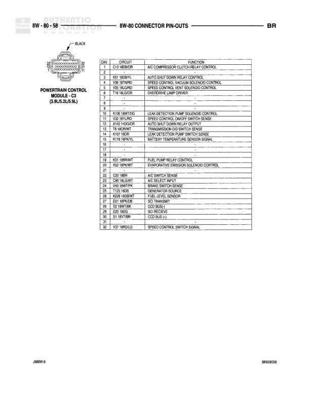

# BR - Connector Pin-Outs

**Notes:** This diagram shows connector pin-out information for various components. Document references: 2BRA/M-9 and BPK00938

## Components

| Component | Ref | Connectors | Notes |
|-----------|-----|------------|-------|
| Left Tailgate Lamp (Dual Rear Wheels) | 8W-80-48 | 2-way connector | Dual rear wheels configuration |
| Left Tweeter (Premium) | 8W-80-48 | 2-way connector | Premium audio system |
| Left Upstream Heated Oxygen Sensor (5.9L HD/8.0L) | 8W-80-48 | 4-way connector | 5.9L HD or 8.0L engine |
| Left Visor/Vanity Lamp | 8W-80-48 | 2-way connector | Black colored component shown |
| Low Note Horn | 8W-80-48 | 2-way connector | None |

## Wires

| From | To | Wire Code | Gauge | Color | Notes |
|------|-----|-----------|-------|-------|-------|
| Left Tailgate Lamp | Pin 1 | Z13 | 18 | BK | Ground |
| Left Tailgate Lamp | Pin 2 | L7 | 18 | BR/WT | Park lamp switch output |
| Left Tweeter | Pin 1 | X9 | 20 | DG/LG | Amplifier left instrument panel speaker(+) |
| Left Tweeter | Pin 2 | X9 | 20 | LG/RD | Amplifier left instrument panel speaker(-) |
| Left Upstream Heated Oxygen Sensor | Pin 1 | A-H | 18 | DG/WT | Auto shut down relay output |
| Left Upstream Heated Oxygen Sensor | Pin 2 | Z11 | 18 | BR/WT | Ground |
| Left Upstream Heated Oxygen Sensor | Pin 3 | K41 | 18 | BK/BK | Left upstream heated oxygen sensor signal |
| Left Upstream Heated Oxygen Sensor | Pin 4 | K41 | 18 | BR/DG | Left upstream heated oxygen sensor signal |
| Left Visor/Vanity Lamp | Pin A | M1 | 22 | GY/BK | Fused B(+) |
| Left Visor/Vanity Lamp | Pin B | Z5 | 20 | BK/BK | Ground |
| Low Note Horn | Pin 1 | B2 | 18 | BR/RD | Horn relay output |
| Low Note Horn | Pin 2 | Z11 | 18 | BK | Ground |
