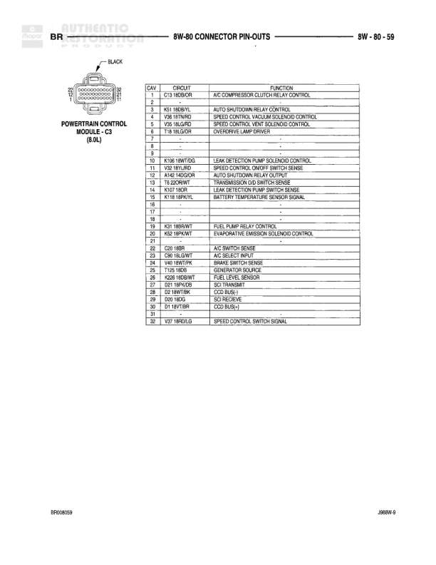

# BR CONNECTOR PIN-OUTS

**Notes:** This diagram shows connector pin-out information for BR series connectors including Low Washer Fluid Switch, Manifold Absolute Pressure Sensors, and Multi-Function Switch. Pin assignments and circuit functions are detailed in tables.

## Components

| Component | Ref | Connectors | Notes |
|-----------|-----|------------|-------|
| LOW WASHER FLUID SWITCH | 2-pin connector | 2-pin connector | Black connector |
| MANIFOLD ABSOLUTE PRESSURE SENSOR | 3-pin connector | 3-pin connector (3.9L/5.2L/5.9L) | 3.9L/5.2L/5.9L engines |
| MANIFOLD ABSOLUTE PRESSURE SENSOR | 3-pin connector | 3-pin connector (8.0L) | 8.0L engine |
| MULTI-FUNCTION SWITCH | 23-pin connector | 23-pin connector | Pins 1D through 23 |

## Cross-References

- 8W-80
