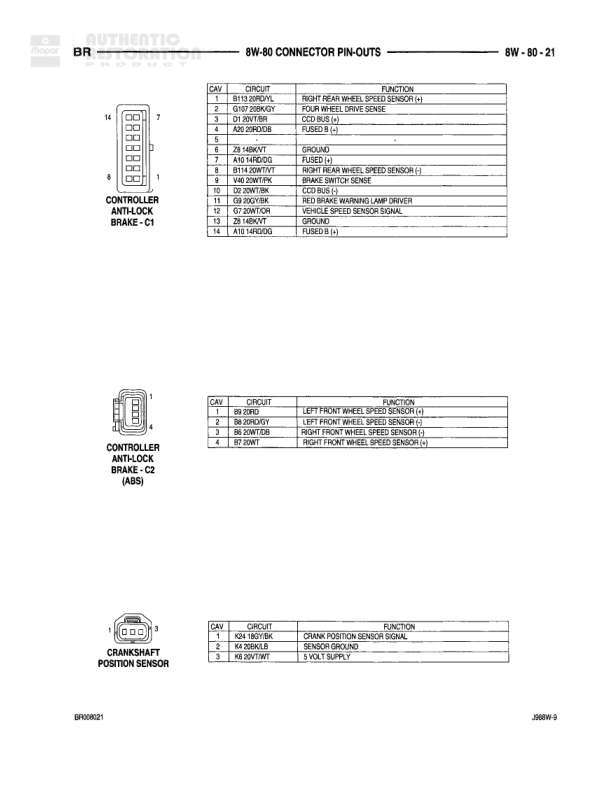

# 8W-80 CONNECTOR PIN-OUTS

**Notes:** *GAS variant wire color; **DIESEL variant wire color. This is a connector pin-out reference page showing terminal assignments for various components in the heating, AC, and 4WD systems.

## Components

| Component | Ref | Connectors | Notes |
|-----------|-----|------------|-------|
| 4X4 SWITCH | 8W-80-5 | C204 | 2-pin connector |
| AC COMPRESSOR CLUTCH | 8W-80-5 | C16 | 2-pin connector |
| HEATER BLOWER MOTOR CONTROL | 8W-80-5 | C212 | 7-pin connector |
| AC HIGH PRESSURE SWITCH | 8W-80-5 | C38 | 2-pin connector, GAS/DIESEL variants noted |

## Wires

| From | To | Wire Code | Gauge | Color | Notes |
|------|-----|-----------|-------|-------|-------|
| 4X4 SWITCH C204 Pin 1 | None | D107 | 18 | BK/YL | 4WD SENSE |
| 4X4 SWITCH C204 Pin 2 | None | Z1 | 18 | BK | GROUND |
| AC COMPRESSOR CLUTCH C16 Pin 1 | None | C3 | 18 | OR/BK | AC CLUTCH RELAY OUTPUT B(+) |
| AC COMPRESSOR CLUTCH C16 Pin 2 | None | Z1 | 18 | BK/WT | GROUND |
| HEATER BLOWER MOTOR CONTROL C212 Pin 1 | None | E2 | 20 | OR | FUSED PANEL LAMPS DIMMER SWITCH SIGNAL |
| HEATER BLOWER MOTOR CONTROL C212 Pin 2 | None | C60 | 20 | GY/WT | AC PRESSURE SWITCH OUTPUT |
| HEATER BLOWER MOTOR CONTROL C212 Pin 3 | None | L4 | 18 | RD | MTR LOWER/MOTOR SPEED |
| HEATER BLOWER MOTOR CONTROL C212 Pin 4 | None | C6 | 18 | YL/D | LO BLOWER MOTOR SPEED |
| HEATER BLOWER MOTOR CONTROL C212 Pin 5 | None | C8 | 18 | YL/D | M2 SPEED |
| HEATER BLOWER MOTOR CONTROL C212 Pin 6 | None | C7 | 18 | OR/YN | HIGH BLOWER MOTOR SPEED |
| HEATER BLOWER MOTOR CONTROL C212 Pin 7 | None | Z1 | 12 | BK/OR | GROUND |
| AC HIGH PRESSURE SWITCH C38 Pin 1 | None | C60 | 18 | LG/WT* | AC HIGH PRESSURE SWITCH OUT |
| AC HIGH PRESSURE SWITCH C38 Pin 1 | None | C60 | 18 | LG** | AC HIGH PRESSURE SWITCH OUT |
| AC HIGH PRESSURE SWITCH C38 Pin 2 | None | C62 | 18 | RD/G | AC HIGH PRESSURE SWITCH IN |
| AC HIGH PRESSURE SWITCH C38 Pin 2 | None | C60 | 18 | LG/WT** | AC HIGH PRESSURE SWITCH IN |
