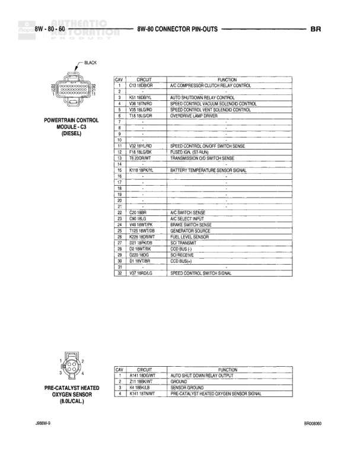

# CONNECTOR PIN-OUTS - BR

**Notes:** *CLEARANCE AND I.D. LAMPS; J08RN-0; BR06A050

## Components

| Component | Ref | Connectors | Notes |
|-----------|-----|------------|-------|
| Overdrive Switch | 8W-80-50 | 2-pin connector | Manual transmission overdrive switch |
| Overhead Console | 8W-80-50 | 13-pin connector | Contains multiple circuits including lamps, sensors, and switches |
| Overhead Map/Courtesy Lamp | 8W-80-50 | 3-pin connector | Rear overhead lamp assembly |
| Park/Neutral Position Switch (ATA) | 8W-80-50 | 3-pin connector | Automatic transmission park/neutral position sensor |
| Passenger Airbag | 8W-80-50 | 2-pin connector | Passenger airbag lines |

## Wires

| From | To | Wire Code | Gauge | Color | Notes |
|------|-----|-----------|-------|-------|-------|
| Overdrive Switch | Pin 1 | T8 | None | Z2/WT | Transmission Overdrive Switch Sense |
| Overdrive Switch | Pin 2 | Z2 | None | GRN/LG | Ground |
| Overhead Console | Pin 1 | L2 | None | GY/BK | Fused Panel Lamps Dimmer Switch Signal |
| Overhead Console | Pin 2 | M1 | None | GY/BK | Park Lamp Switch Output |
| Overhead Console | Pin 3 | L7 | None | 180/YL* | Park Lamp Switch Output |
| Overhead Console | Pin 4 | K32 | None | 2BR/LB | Sensor Ground |
| Overhead Console | Pin 5 | G21 | None | 2GY/LG | Ambient Temperature Sensor Signal |
| Overhead Console | Pin 6 | M2 | None | 12YL | Courtesy Lamps Driver |
| Overhead Console | Pin 7 | P4 | None | 22GR/WT | Fused Ign. (B1-Run) |
| Overhead Console | Pin 8 | None | None | None | None |
| Overhead Console | Pin 9 | Z2 | None | 20BK/LB | Ground |
| Overhead Console | Pin 10 | None | None | None | None |
| Overhead Console | Pin 11 | X4 | None | 18BK | Ground |
| Overhead Console | Pin 12 | None | None | None | None |
| Overhead Console | Pin 13 | M1 | None | 18PK | Visor/Vanity Lamps Switch |
| Overhead Map/Courtesy Lamp | Pin 1 | X4 | None | 18BK | Ground |
| Overhead Map/Courtesy Lamp | Pin 2 | M2 | None | 12YL | Courtesy Lamps Driver |
| Overhead Map/Courtesy Lamp | Pin 3 | M1 | None | 20PK | Fused B(+) |
| Park/Neutral Position Switch (ATA) | Pin 1 | L10 | None | 18BR/LG | Fused Ign. Switch Output |
| Park/Neutral Position Switch (ATA) | Pin 2 | T6 | None | 18LB/RD | Park/Neutral Position Switch Sensor |
| Park/Neutral Position Switch (ATA) | Pin 3 | L1 | None | 18YL/BR | Backup Lamp Switch Output |
| Passenger Airbag | Pin 1 | R44 | None | 18BK/YL | Passenger Airbag Line 1 |
| Passenger Airbag | Pin 2 | R44 | None | 18GY/YL | Passenger Airbag Line 2 |
