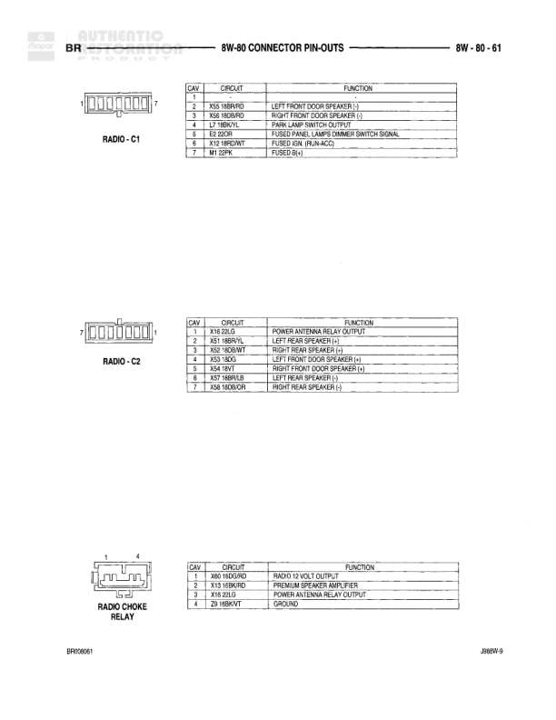

# Connector Pin-Outs - Passenger Airbag, Seat Solenoid, Post Catalyst Sensor, and Power Mirror Switch

**Notes:** This page shows connector pin-outs for various components including airbag systems, seat solenoid, oxygen sensor, and power mirror switch. Document numbers BR080401 and JMB9W-9 are referenced at bottom.

## Components

| Component | Ref | Connectors | Notes |
|-----------|-----|------------|-------|
| Passenger Airbag Disarm Switch | C1 | C1 | 2-pin connector |
| Passenger Airbag Disarm Switch | C2 | C2 | 4-pin connector |
| Passenger Seat Solenoid | None | 2-pin connector | None |
| Post Catalyst Heated Oxygen Sensor (8 M.CAL.) | None | 4-pin connector | 8 M.CAL. application |
| Power Mirror Switch | None | 8-pin connector | None |

## Wires

| From | To | Wire Code | Gauge | Color | Notes |
|------|-----|-----------|-------|-------|-------|
| Passenger Airbag Disarm Switch C1 | Pin 1 | F14 | 18 | GY/YL | FUSED IGN. RET./RUN |
| Passenger Airbag Disarm Switch C1 | Pin 2 | Z5 | 18 | BK/TN | GROUND |
| Passenger Airbag Disarm Switch C2 | Pin 1 | R142 | 18 | BK/YL | PASSENGER SQAUB LINE + |
| Passenger Airbag Disarm Switch C2 | Pin 2 | R143 | 18 | DG/YL | PASSENGER SQAUB LINE - |
| Passenger Airbag Disarm Switch C2 | Pin 3 | R82 | 18 | BR/YL | PASSENGER SQAUB LINE 2 |
| Passenger Airbag Disarm Switch C2 | Pin 4 | R84 | 18 | GY/DG | PASSENGER SQAUB LINE 1 |
| Passenger Seat Solenoid | Pin 1 | Z5 | 18 | BK/GY | GROUND |
| Passenger Seat Solenoid | Pin 2 | N8 | 18 | DG/RD | SIGNAL FROM SECM |
| Post Catalyst Heated Oxygen Sensor | Pin 1 | K144 | 18 | BK/WT | AUTO SHUT DOWN RELAY OUTPUT |
| Post Catalyst Heated Oxygen Sensor | Pin 2 | K92 | 18 | BK/LB | SENSOR SIGNAL |
| Post Catalyst Heated Oxygen Sensor | Pin 3 | K4 | 18 | BR/LB | SENSOR GROUND |
| Post Catalyst Heated Oxygen Sensor | Pin 4 | K341 | 18 | DG/BR | POST CATALYST HEATED OXYGEN SENSOR SIGNAL |
| Power Mirror Switch | Pin 1 | P71 | 20 | WT | POWER MIRROR LEFT CONTROL |
| Power Mirror Switch | Pin 2 | P69 | 20 | LB/WT | POWER MIRROR UP CONTROL |
| Power Mirror Switch | Pin 3 | P73 | 20 | VT/LPK | POWER MIRROR RIGHT/DOWN CONTROL |
| Power Mirror Switch | Pin 4 | P72 | 20 | VT/LBK | POWER MIRROR UP CONTROL |
| Power Mirror Switch | Pin 5 | P68 | 20 | BR/WT | POWER MIRROR DOWN CONTROL |
| Power Mirror Switch | Pin 6 | P70 | 20 | WT | POWER MIRROR RIGHT/DOWN CONTROL |
| Power Mirror Switch | Pin 7 | M1 | 22 | PK | FUSED B(+) |
| Power Mirror Switch | Pin 8 | Z2 | 20 | BK/LG | GROUND |

## Cross-References

- 8W-80
