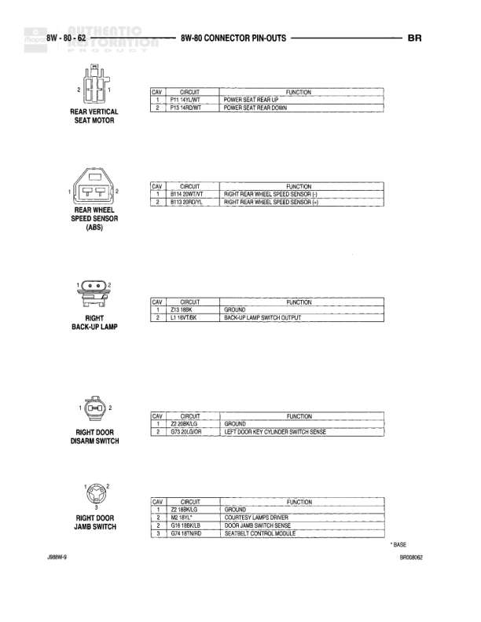

# 8W-80 CONNECTOR PIN-OUTS

**Notes:** This is a connector pin-out reference diagram for the Powertrain Control Module C1 (Black) connector showing all 32 pins and their functions. Document reference BR08N053, Page J88W-9

## Components

| Component | Ref | Connectors | Notes |
|-----------|-----|------------|-------|
| POWERTRAIN CONTROL MODULE - C1 (BLK) | 8W-80-53 | C1 | Black connector, 32-pin |

## Wires

| From | To | Wire Code | Gauge | Color | Notes |
|------|-----|-----------|-------|-------|-------|
| C1 Pin 1 | IGN COIL NO. 1 DRIVER | K43 | None | BR/LGY | None |
| C1 Pin 2 | FUSED IGN. B+ RUN | F18 | None | 10 DGN | None |
| C1 Pin 3 | IGN. COIL NO. 3 DRIVER | K18 | None | BR/LINK | None |
| C1 Pin 4 | INJECTOR NO. 3 DRIVER | K43 | None | WT/DB | None |
| C1 Pin 5 | IGN. COIL NO. 1 DRIVER | K43 | None | 18GY/Y | None |
| C1 Pin 6 | PARK/NEUTRAL POSITION SWITCH SENSE | T41 | None | 18GY/Y | None |
| C1 Pin 7 | IGN. COIL NO. 2 DRIVER | K15 | None | 18DGY/BR | None |
| C1 Pin 8 | CRANK POSITION SENSOR SIGNAL | K25 | None | MD Y/BR | None |
| C1 Pin 9 | IGN. COIL NO. 3 DRIVER | K17 | None | 18GY/WT | None |
| C1 Pin 10 | IDLE AIR CONTROL NO. 1 DRIVER | K60 | None | 18Y/BK | None |
| C1 Pin 11 | IDLE AIR CONTROL NO. 3 DRIVER | K42 | None | 18BR/WT | None |
| C1 Pin 12 | None | None | None | None | Empty pin |
| C1 Pin 13 | PTO SWITCH SENSE | G113 | None | 18GR | None |
| C1 Pin 14 | None | None | None | None | Empty pin |
| C1 Pin 15 | INTAKE AIR TEMPERATURE SIGNAL | K2 | None | 18TN/RD | None |
| C1 Pin 16 | ENGINE COOLANT TEMPERATURE SENSOR SIGNAL | K2 | None | 18TN/BR | None |
| C1 Pin 17 | 5 VOLT SUPPLY | K6 | None | 18VY/VT | None |
| C1 Pin 18 | FUEL LEVEL SENSOR INPUT SIGNAL | K28 | None | 18LBRD | None |
| C1 Pin 19 | IDLE AIR CONTROL NO. 1 DRIVER | K38 | None | 18VT/RD | None |
| C1 Pin 20 | IDLE AIR CONTROL NO. 4 DRIVER | K53 | None | 18VT/BR | None |
| C1 Pin 21 | None | None | None | None | Empty pin |
| C1 Pin 22 | FUSED (IG.) | A14 | None | 18RD/WT | None |
| C1 Pin 23 | THROTTLE POSITION SENSOR SIGNAL | K2 | None | 18GN/OR | None |
| C1 Pin 24 | DOWNSTREAM HEATED OXYGEN SENSOR SIGNAL | K41 | None | 18BK/DG | None |
| C1 Pin 25 | DOWNSTREAM HEATED OXYGEN SENSOR SIGNAL | K241 | None | 18GR/BK | None |
| C1 Pin 26 | UPSTREAM HEATED OXYGEN SENSOR SIGNAL | K4 | None | 18BK/LG | None |
| C1 Pin 27 | MAP SENSOR SIGNAL | K1 | None | 18GY/RD | None |
| C1 Pin 28 | None | None | None | None | Empty pin |
| C1 Pin 29 | UPSTREAM HEATED OXYGEN SENSOR SIGNAL | K141 | None | 18TN/WT | None |
| C1 Pin 30 | None | None | None | None | Empty pin |
| C1 Pin 31 | GROUND | Z12 | None | 12BK/TN | None |
| C1 Pin 32 | GROUND | Z12 | None | 14BK/TN | None |
