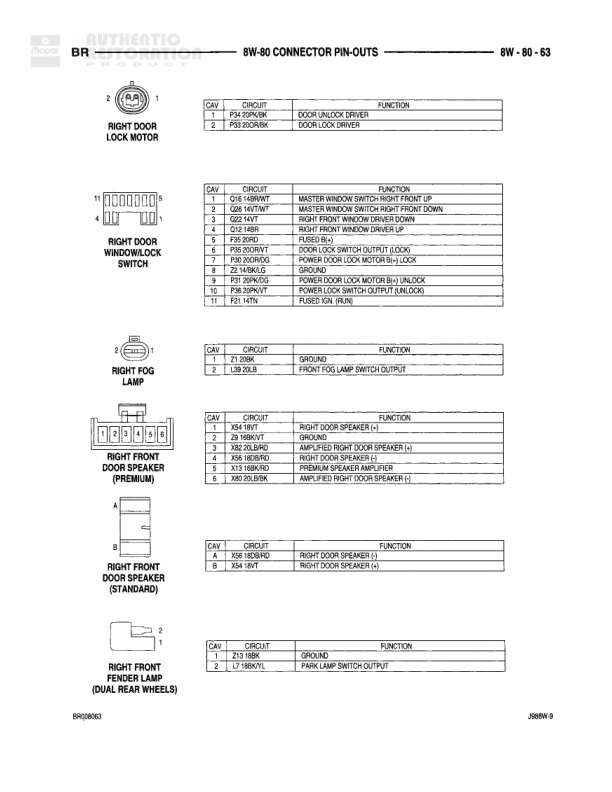

# 8W-80 CONNECTOR PIN-OUTS - POWERTRAIN CONTROL MODULE - C1 (DIESEL)

**Notes:** Pin-out table for Powertrain Control Module C1 connector (Diesel). Pins 2, 3, 7, 10-13, 15, 18-21, 24-26, 28-30 are not used or listed as vacant. Connector color: BLACK.

## Components

| Component | Ref | Connectors | Notes |
|-----------|-----|------------|-------|
| Powertrain Control Module - C1 (Diesel) | 8W-80-54 | C1 | 32-pin connector, BLACK color |

## Wires

| From | To | Wire Code | Gauge | Color | Notes |
|------|-----|-----------|-------|-------|-------|
| PCM C1 Pin 1 | Fused B+ (RUN) | F18 | None | RD/BK | FUSED IGN (BY-RUN) |
| PCM C1 Pin 4 | Sensor Ground | K4 | None | BK/LB | SENSOR GROUND |
| PCM C1 Pin 5 | Park/Neutral Position Sensor | T41 | None | VT/WT | PARK/NEUTRAL POSITION SENSOR SIGNAL |
| PCM C1 Pin 6 | Air Intake Heater Relay No. 1 Control | K51 | None | WT/LB | AIR INTAKE HEATER RELAY NO. 1 CONTROL |
| PCM C1 Pin 8 | Engine Speed Sensor | K24 | None | DB/YL | ENGINE SPEED SENSOR SIGNAL |
| PCM C1 Pin 9 | Air Intake Heater Relay No. 1 Control | K52 | None | DG/BK | AIR INTAKE HEATER RELAY NO. 1 CONTROL |
| PCM C1 Pin 14 | Intake Air Temperature Sensor | K21 | None | TN/RD | INTAKE AIR TEMPERATURE SENSOR SIGNAL |
| PCM C1 Pin 16 | Engine Coolant Temperature Sensor | K2 | None | TN/BK | ENGINE COOLANT TEMPERATURE SENSOR SIGNAL |
| PCM C1 Pin 17 | 5 Volt Supply | K6 | None | VT/WT | 5 VOLT SUPPLY |
| PCM C1 Pin 22 | Fused Ignition | A14 | None | DB/WT | FUSED IGN |
| PCM C1 Pin 23 | Throttle Position Sensor | K22 | None | RD/DB | THROTTLE POSITION SENSOR SIGNAL |
| PCM C1 Pin 27 | Water in Fuel Sensor | K1 | None | DG/RD | WATER IN FUEL SENSOR SIGNAL |
| PCM C1 Pin 31 | Ground | Z12 | None | BK/TN | GROUND |
| PCM C1 Pin 32 | Ground | Z12 | None | BK/TN | GROUND |
