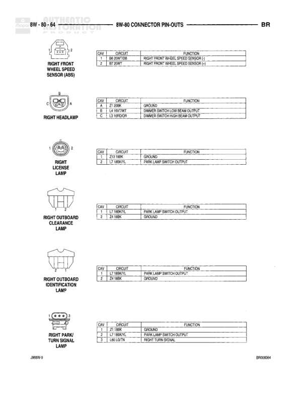

# POWERTRAIN CONTROL MODULE - C2 CONNECTOR PIN-OUTS

**Notes:** This is a connector pin-out diagram showing the C2 connector of the Powertrain Control Module for 3.9L/5.2L/5.9L engines. Pins 7, 8, 9, 14, 17, 18, 19, 20, 22, 24, 26, and 32 are not used or not shown.

## Components

| Component | Ref | Connectors | Notes |
|-----------|-----|------------|-------|
| Powertrain Control Module - C2 | 8W-80-55 | C2 | 32-pin connector (3.9L/5.2L/5.9L engines) |

## Wires

| From | To | Wire Code | Gauge | Color | Notes |
|------|-----|-----------|-------|-------|-------|
| PCM C2 Pin 1 | Transmission Temperature Sensor | T34 | None | TN/YL | Transmission Temperature Sensor Signal |
| PCM C2 Pin 2 | Injector No. 7 | K26 | None | BR/TN | Injector No. 7 Driver |
| PCM C2 Pin 3 | Injector No. 1 | K21 | None | BR/TN OR | Injector No. 1 Driver |
| PCM C2 Pin 4 | Injector No. 3 | K23 | None | WT/VT | Injector No. 3 Driver |
| PCM C2 Pin 5 | Injector No. 4 | K26 | None | MD/YL | Injector No. 4 Driver |
| PCM C2 Pin 6 | Variable Force Solenoid | K28 | None | WT/VT | Variable Force Solenoid |
| PCM C2 Pin 10 | Generator Field Driver | K40 | None | MD/G | Generator Field Driver |
| PCM C2 Pin 11 | Torque Converter Clutch Solenoid/Relay Control | K24 | None | MD/BK | Torque Converter Clutch Solenoid/Relay Control |
| PCM C2 Pin 12 | Injector No. 6 | K25 | None | BR/VGB | Injector No. 6 Driver |
| PCM C2 Pin 13 | Injector No. 8 | K28 | None | BR/CLB | Injector No. 8 Driver |
| PCM C2 Pin 15 | Injector No. 2 | K12 | None | WT/N | Injector No. 2 Driver |
| PCM C2 Pin 16 | Injector No. 4 | K14 | None | HL/LSBR | Injector No. 4 Driver |
| PCM C2 Pin 21 | Overdrive Solenoid Control | T80 | None | LSBR | Overdrive Solenoid Control |
| PCM C2 Pin 23 | Engine Oil Pressure Sensor | G90 | None | TN/YOR | Engine Oil Pressure Sensor Signal |
| PCM C2 Pin 25 | Speed Sensor Ground | T11 | None | BR/BK | Speed Sensor Ground |
| PCM C2 Pin 27 | Vehicle Speed Sensor | D7 | None | WT/OR | Vehicle Speed Sensor Signal |
| PCM C2 Pin 28 | Overdrive Pressure Switch | T30 | None | TN/WT | Overdrive Pressure Switch Signal |
| PCM C2 Pin 29 | Governor Pressure Signal | T35 | None | LG/WT | Governor Pressure Signal |
| PCM C2 Pin 30 | Transmission Relay Control | K30 | None | NR/K | Transmission Relay Control |
| PCM C2 Pin 31 | 5-Volt Supply | K7 | None | BQ/R | 5-Volt Supply |
