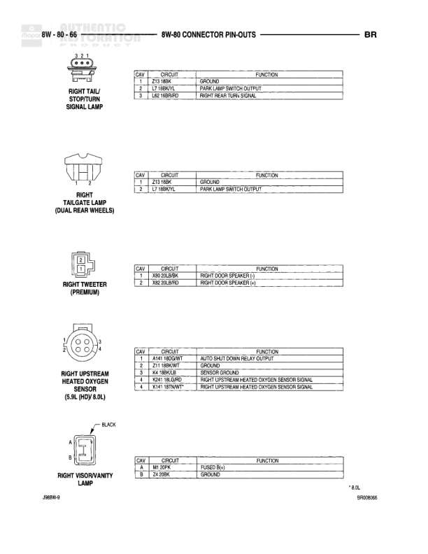

# 8W-80 CONNECTOR PIN-OUTS - Powertrain Control Module C2

**Notes:** This is a connector pin-out reference diagram showing the 32-pin C2 connector for the Powertrain Control Module. Pins 2-7, 9, 12-18, 20, 22, 24, and 26 are not used. Document reference: BR082057

## Components

| Component | Ref | Connectors | Notes |
|-----------|-----|------------|-------|
| Powertrain Control Module - C2 | 8W-80-57 | C2 | 32-pin connector, BLACK color |

## Wires

| From | To | Wire Code | Gauge | Color | Notes |
|------|-----|-----------|-------|-------|-------|
| PCM C2 Pin 1 | Transmission Temperature Sensor Signal | T44 | None | DG/YL | Transmission Temperature Sensor Signal |
| PCM C2 Pin 8 | Transmission Variable Force Solenoid | K68 | None | BR/TN | Transmission Variable Force Solenoid |
| PCM C2 Pin 10 | Generator Field Driver | K29 | None | DB/OR | Generator Field Driver |
| PCM C2 Pin 11 | Torque Converter Clutch Solenoid Control | K34 | None | RD/BK | Torque Converter Clutch Solenoid Control |
| PCM C2 Pin 19 | Wait-to-Start Warning Lamp Driver | K86 | None | RD/OR | Wait-to-Start Warning Lamp Driver |
| PCM C2 Pin 21 | Solenoid No. 2 Control | T60 | None | YL/BR | Solenoid No. 2 Control |
| PCM C2 Pin 23 | Cruise Oil Pressure Sensor Signal | G80 | None | RD/GY | Cruise Oil Pressure Sensor Signal |
| PCM C2 Pin 25 | Shaft Speed Signal | T13 | None | VT/BR | Shaft Speed Signal |
| PCM C2 Pin 27 | Vehicle Speed Sensor Signal | C2 | None | WT/OR | Vehicle Speed Sensor Signal |
| PCM C2 Pin 28 | Output Speed Sensor Signal | T14 | None | YL/BK | Output Speed Sensor Signal |
| PCM C2 Pin 29 | Governor Pressure Signal | T28 | None | YL/WT | Governor Pressure Signal |
| PCM C2 Pin 30 | Transmission Relay Control | K26 | None | BR/PK | Transmission Relay Control |
| PCM C2 Pin 31 | Solenoid Switch Sense | K25 | None | PK/BK | Solenoid Switch Sense |
| PCM C2 Pin 32 | EGR Solenoid Control | K36 | None | BR/YL | EGR Solenoid Control |
