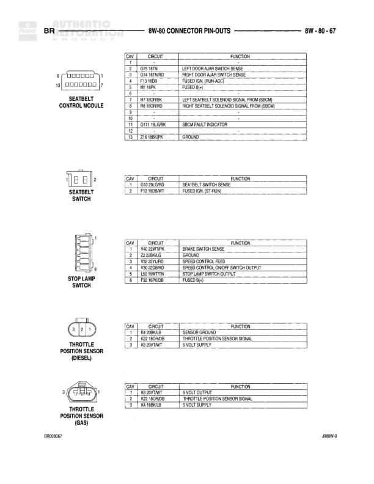

# 8W-80 CONNECTOR PIN-OUTS - POWERTRAIN CONTROL MODULE - BR

**Notes:** This is a connector pin-out reference diagram for the Powertrain Control Module (PCM) showing the BLACK connector with circuit assignments and wire colors for each pin. Pins 2, 7, 8, 10, 16, 17, 18, 21, and 31 are not used.

## Components

| Component | Ref | Connectors | Notes |
|-----------|-----|------------|-------|
| Powertrain Control Module | 8W-80-58 | C1 (3 plugs, 2L/2L/9L) | BR designation, BLACK colored connector shown |

## Wires

| From | To | Wire Code | Gauge | Color | Notes |
|------|-----|-----------|-------|-------|-------|
| C1 Pin 1 | AC Compressor Clutch Relay Control | None | None | None | None |
| C1 Pin 3 | Auto Shut Down Relay Control | K51 | 18 | DB/WT | None |
| C1 Pin 4 | Speed Control, Vacuum Solenoid Control | V36 | 18 | TN/RD | None |
| C1 Pin 5 | Speed Control, Vent Solenoid Control | V35 | 18 | LG/RD | None |
| C1 Pin 6 | Overdrive Lamp Driver | T18 | 18 | LG/OR | None |
| C1 Pin 9 | Speed Control, Servo Power Control | V15 | 18 | WT/VT | None |
| C1 Pin 11 | Speed Control, On/Off Switch Sense | V32 | 18 | TN/LG | None |
| C1 Pin 12 | Auto Shut Down Relay Output | A142 | 14 | DG/OR | None |
| C1 Pin 13 | Transmission O/D Switch Sense | T8 | 18 | DG/WT | None |
| C1 Pin 14 | Leak Detection Pump Switch Sense | K107 | 18 | BR/WT | None |
| C1 Pin 15 | Low/High Speed Fan Relay Control | K53 | 18 | GY/YL | None |
| C1 Pin 19 | Fuel Pump Relay Control | K31 | 18 | DB/WT | None |
| C1 Pin 20 | Evaporative Emission Solenoid Control | K52 | 18 | LB/OR | None |
| C1 Pin 22 | A/C Switch Sense | C40 | 18 | BR/LG | None |
| C1 Pin 23 | A/C Select Input | C36 | 18 | YL/WT | None |
| C1 Pin 24 | Brake Switch Sense | K60 | 18 | WT/PK | None |
| C1 Pin 25 | Generator Source | F122 | 18 | DB/OR | None |
| C1 Pin 26 | Generator Field | K23 | 18 | DG/OR | None |
| C1 Pin 27 | SCI Transmit | D21 | 18 | VT/BR | None |
| C1 Pin 28 | CCD Bus+ | D2 | 18 | WT/OR | None |
| C1 Pin 29 | SCI Receive | D22 | 18 | WT/DG | None |
| C1 Pin 30 | CCD Bus (-) | D1 | 18 | TN/YL | None |
| C1 Pin 32 | Speed Control Switch Signal | V37 | 18 | OR/LG | None |
