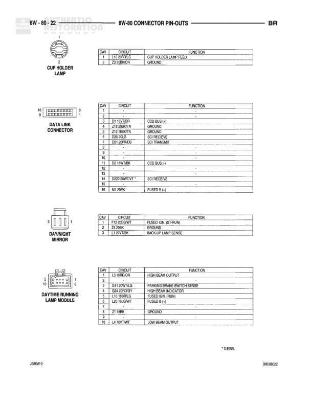

# 8W-80 CONNECTOR PIN-OUTS

**Notes:** This is a connector pin-out reference page showing pinout details for A/C Low Pressure Switch (2-pin), Airbag Control Module (23-pin), and Ambient Temperature Sensor (2-pin, W/Diesel only). Document reference BR036926.

## Components

| Component | Ref | Connectors | Notes |
|-----------|-----|------------|-------|
| A/C Low Pressure Switch | 8W-80-6 | 2-pin connector | AC low pressure switch connector |
| Airbag Control Module | 8W-80-6 | 23-pin connector | Airbag control module connector with pins 1-23 |
| Ambient Temperature Sensor | JBBW-9 | 2-pin connector | W/Diesel only |

## Wires

| From | To | Wire Code | Gauge | Color | Notes |
|------|-----|-----------|-------|-------|-------|
| A/C Low Pressure Switch Pin 1 | None | C30 | 18 | BR | AC SWITCH SENSE IN |
| A/C Low Pressure Switch Pin 2 | None | C32 | 18 | DB | A/C LOW PRESSURE SWITCH OUT |
| A/C Low Pressure Switch Pin 2 | None | C96 | 18 | DG/WT | A/C LOW PRESSURE SWITCH OUT |
| Airbag Control Module Pin 5 | None | Z8 | 18 | BK/DG | GROUND |
| Airbag Control Module Pin 6 | None | H45 | 18 | YL/DB | DRIVER AIRBAG LINE 1 |
| Airbag Control Module Pin 8 | None | H45 | 18 | DG/LB | DRIVER AIRBAG LINE 2 |
| Airbag Control Module Pin 7 | None | R142 | 18 | BR/VT | PASSENGER AIRBAG LINE 1 |
| Airbag Control Module Pin 9 | None | R144 | 18 | DB/GY | PASSENGER AIRBAG LINE 2 |
| Airbag Control Module Pin 14 | None | F14 | 18 | RD/YL | FUSED IGN. (R/RUN) |
| Airbag Control Module Pin 15 | None | F24 | 18 | RD/VT | FUSED IGN. (RUN) |
| Airbag Control Module Pin 16 | None | D111 | 18 | LB/OR | SBC/M FAULT SIGNAL |
| Airbag Control Module Pin 21 | None | D2 | 18 | TN/YBR | CCD BUS (+) |
| Airbag Control Module Pin 22 | None | D2 | 18 | LBY/BK | CCD BUS (-) |
| Ambient Temperature Sensor Pin 1 | None | G31 | 20 | VT/LG | AMBIENT TEMPERATURE SENSOR SIGNAL |
| Ambient Temperature Sensor Pin 2 | None | D32 | 20 | BK/VT | SENSOR GROUND |

## Cross-References

- JBBW-9
