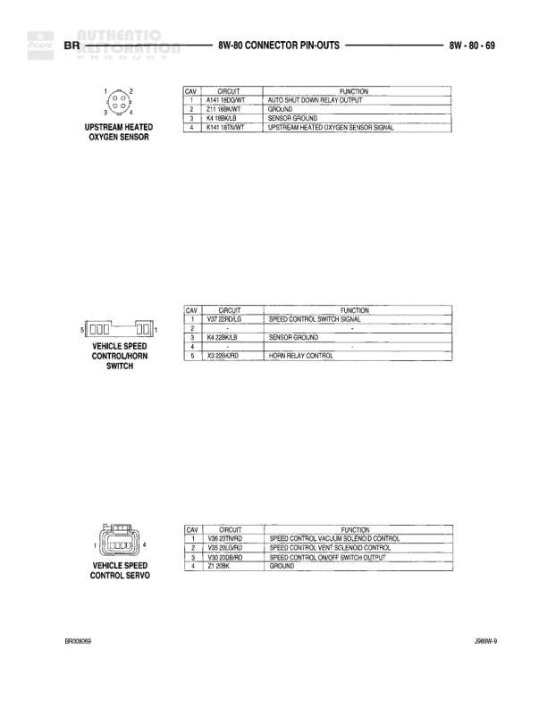

# 8W-80 CONNECTOR PIN-OUTS

**Notes:** Pin-out diagrams for Powertrain Control Module (Diesel) and Pre-Catalyst Heated Oxygen Sensor. Document reference: JR809-0, dated 8/30/2000. Empty pins 3, 6, 8-10, 14, 16-21, and 31 on PCM connector.

## Components

| Component | Ref | Connectors | Notes |
|-----------|-----|------------|-------|
| Powertrain Control Module | C-13 (DIESEL) | C-13 | 40-pin connector for diesel engine |
| Pre-Catalyst Heated Oxygen Sensor | 8 (8L/CAL) | 8-way connector | 8L/CAL designation |

## Wires

| From | To | Wire Code | Gauge | Color | Notes |
|------|-----|-----------|-------|-------|-------|
| C-13 Pin 1 | A/C Compressor Clutch Relay Control | C19 | None | BR/OR | CIRCUIT: 1BR/OR |
| C-13 Pin 2 | Auto Shutdown Relay Control | K51 | 18 | DB/YL | CIRCUIT: 18DB/YL |
| C-13 Pin 4 | Speed Control Vacuum Solenoid Control | V36 | 18 | TN/RD | CIRCUIT: 18TN/RD |
| C-13 Pin 5 | Speed Control Vent Solenoid Control | V35 | 18 | TN/ORD | CIRCUIT: 18TN/ORD |
| C-13 Pin 7 | Overdrive-Lamp Driver | T11 | 18 | DB/OR | CIRCUIT: 18DB/OR |
| C-13 Pin 11 | Speed Control On/Off Switch Sense | V32 | 18 | YL/RD | CIRCUIT: 18YL/RD |
| C-13 Pin 12 | Fused B+ (BT-Run) | F14 | 18 | DB/PK | CIRCUIT: 18DB/PK |
| C-13 Pin 13 | Transmission O/D Switch Sense | T6 | 20 | GY/WT | CIRCUIT: 20GY/WT |
| C-13 Pin 15 | Battery Temperature Sensor Signal | K119 | 18 | PK/YL | CIRCUIT: 18PK/YL |
| C-13 Pin 22 | A/C Switch Sense | C20 | 18 | BR | CIRCUIT: 18BR |
| C-13 Pin 23 | A/C Select Input | C90 | 18 | LG | CIRCUIT: 18LG |
| C-13 Pin 24 | Brake Switch Sense | V83 | 18 | WT/PK | CIRCUIT: 18WT/PK |
| C-13 Pin 25 | Generator Field Driver | L1 | 18 | DG/OR | CIRCUIT: 18DG/OR |
| C-13 Pin 26 | Fuel Level Sensor | K226 | 18 | VT/WT | CIRCUIT: 18VT/WT |
| C-13 Pin 27 | SCI Transmit | D21 | 18 | PK/DB | CIRCUIT: 18PK/DB |
| C-13 Pin 28 | SCI Receive | D20 | 18 | VT/BR | CIRCUIT: 18VT/BR |
| C-13 Pin 29 | SCI Receive | D203 | 18 | YL | CIRCUIT: 18YL |
| C-13 Pin 30 | CCD Bus(+) | D1 | 18 | VT/BR | CIRCUIT: 18VT/BR |
| C-13 Pin 32 | Speed Control Switch Signal | V37 | 18 | BR/LG | CIRCUIT: 18BR/LG |
| Oxygen Sensor Pin 1 | Auto Shut Down Relay Output | A141 | 18 | RD/WT | CIRCUIT: 18RD/WT |
| Oxygen Sensor Pin 2 | Ground | Z1 | 18 | BK/LB | CIRCUIT: 18BK/LB |
| Oxygen Sensor Pin 3 | Sensor Ground | K4 | 18 | BK/LB | CIRCUIT: 18BK/LB |
| Oxygen Sensor Pin 4 | Pre-Catalyst Heated Oxygen Sensor Signal | K211 | 18 | BT/WT | CIRCUIT: 18BT/WT |
