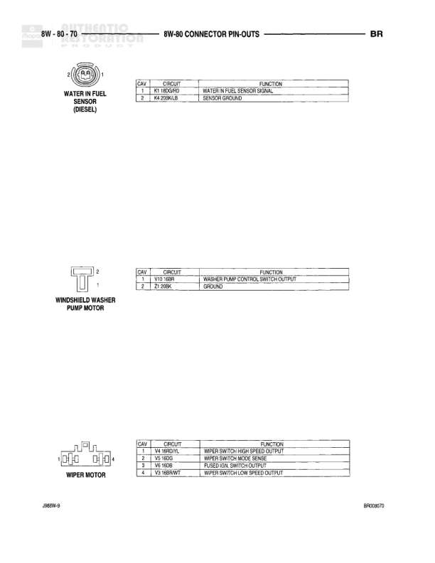

# 8W-80 CONNECTOR PIN-OUTS

**Notes:** Connector pin-out reference page showing Radio C1, Radio C2, and Radio Choke Relay connector assignments. Document references BR00801 and JR00/9.

## Components

| Component | Ref | Connectors | Notes |
|-----------|-----|------------|-------|
| RADIO | RADIO-C1 | C1 | 7-pin connector |
| RADIO | RADIO-C2 | C2 | 7-pin connector |
| RADIO CHOKE RELAY | RADIO CHOKE RELAY | 4-pin connector | 4-pin relay |

## Wires

| From | To | Wire Code | Gauge | Color | Notes |
|------|-----|-----------|-------|-------|-------|
| RADIO-C1 | Pin 1 |  | None |  | Function not specified |
| RADIO-C1 | Pin 2 | X25 | None | RD/WT | LEFT FRONT DOOR SPEAKER (-) |
| RADIO-C1 | Pin 3 | X24 | None | RD/BK | RIGHT FRONT DOOR SPEAKER (-) |
| RADIO-C1 | Pin 4 | E2 | None | OR/WT | DIMMER |
| RADIO-C1 | Pin 5 | E2 | None | DG/N | FUSED PANEL LAMPS DIMMER SWITCH SIGNAL |
| RADIO-C1 | Pin 6 | A14 | None | BR/WT | FUSED (ON, RUN-ACC) |
| RADIO-C1 | Pin 7 | M1 | None | BR/YL | FUSED(M1) |
| RADIO-C2 | Pin 1 | X09 | None | VT/BK | POWER ANTENNA MOTOR OUTPUT |
| RADIO-C2 | Pin 2 | X31 | None | BR/YL | LEFT REAR SPEAKER (+) |
| RADIO-C2 | Pin 3 | X29 | None | DB/WT | RIGHT REAR SPEAKER (+) |
| RADIO-C2 | Pin 4 | X30 | None | VT/G | LEFT FRONT DOOR SPEAKER (+) |
| RADIO-C2 | Pin 5 | X04 | None | GY/L | RIGHT FRONT DOOR SPEAKER (+) |
| RADIO-C2 | Pin 6 | X28 | None | LG/WT/YL | LEFT REAR SPEAKER (-) |
| RADIO-C2 | Pin 7 | X38 | None | TN/BK/N | RIGHT REAR SPEAKER (-) |
| RADIO CHOKE RELAY | Pin 1 | X66 | None | LB/OR/D | RADIO 12 VOLT OUTPUT |
| RADIO CHOKE RELAY | Pin 2 | X05 | None | PK/LB | RADIO SPEAKER AMPLIFIER |
| RADIO CHOKE RELAY | Pin 3 | X18 | None | GY/L/D | POWER ANTENNA RELAY OUTPUT |
| RADIO CHOKE RELAY | Pin 4 | Z8 | None | DB/WT | GROUND |
