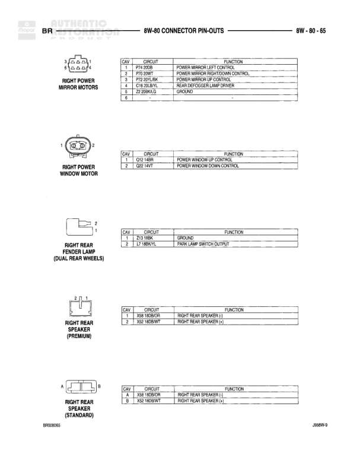

# 8W-80 CONNECTOR PIN-OUTS - BR

**Notes:** This page shows connector pin-outs for various right side components including ABS wheel speed sensor, headlamp, license lamp, clearance lamps, identification lamp, and park/turn signal lamp. Document reference: J8WBW-9, BRW08064

## Components

| Component | Ref | Connectors | Notes |
|-----------|-----|------------|-------|
| RIGHT FRONT WHEEL SPEED SENSOR (ABS) | 8W-80-64 | 2-pin connector | ABS wheel speed sensor |
| RIGHT HEADLAMP | 8W-80-64 | 3-pin connector | Headlamp assembly with ground, dimmer switch low beam output, and dimmer switch high beam output |
| RIGHT LICENSE LAMP | 8W-80-64 | 2-pin connector | License plate illumination |
| RIGHT OUTBOARD CLEARANCE LAMP | 8W-80-64 | 2-pin connector | Outboard clearance light |
| RIGHT OUTBOARD IDENTIFICATION LAMP | 8W-80-64 | 2-pin connector | Outboard identification light |
| RIGHT PARK/ TURN SIGNAL LAMP | 8W-80-64 | 3-pin connector | Combined park and turn signal lamp |

## Wires

| From | To | Wire Code | Gauge | Color | Notes |
|------|-----|-----------|-------|-------|-------|
| RIGHT FRONT WHEEL SPEED SENSOR | Pin 1 | B6 | None | DW/T58 | RIGHT FRONT WHEEL SPEED SENSOR (-) |
| RIGHT FRONT WHEEL SPEED SENSOR | Pin 2 | B7 | None | DW/T | RIGHT FRONT WHEEL SPEED SENSOR (+) |
| RIGHT HEADLAMP | Pin A | Z1 | None | BK | GROUND |
| RIGHT HEADLAMP | Pin B | L4 | None | DB/WT | DIMMER SWITCH LOW BEAM OUTPUT |
| RIGHT HEADLAMP | Pin C | L3 | None | VT/BOR | DIMMER SWITCH HIGH BEAM OUTPUT |
| RIGHT LICENSE LAMP | Pin 1 | A23 | None | TN/BK | GROUND |
| RIGHT LICENSE LAMP | Pin 2 | L2 | None | LB/WT-L | PARK LAMP SWITCH OUTPUT |
| RIGHT OUTBOARD CLEARANCE LAMP | Pin 1 | L7 | None | LB/WT-L | PARK LAMP SWITCH OUTPUT |
| RIGHT OUTBOARD CLEARANCE LAMP | Pin 2 | Z4 | None | BK | GROUND |
| RIGHT OUTBOARD IDENTIFICATION LAMP | Pin 1 | L7 | None | LB/WT-L | PARK LAMP SWITCH OUTPUT |
| RIGHT OUTBOARD IDENTIFICATION LAMP | Pin 2 | Z4 | None | BK | GROUND |
| RIGHT PARK/TURN SIGNAL LAMP | Pin 1 | Z1 | None | BK | GROUND |
| RIGHT PARK/TURN SIGNAL LAMP | Pin 2 | L7 | None | LB/WT-L | PARK LAMP SWITCH OUTPUT |
| RIGHT PARK/TURN SIGNAL LAMP | Pin 3 | L60 | None | LG/TN | RIGHT TURN SIGNAL |
