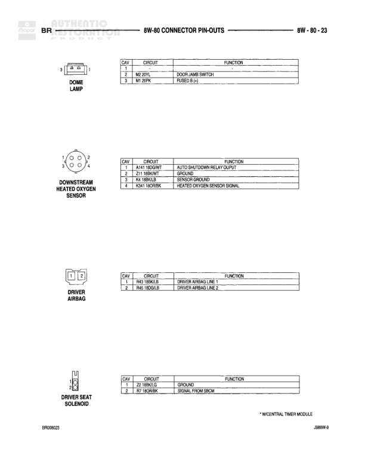

# BR - Automatic Connector Pin-Outs

**Notes:** Page shows connector pin-outs for Automatic transmission BR variant. Document references: BR00007 and J0BRV-9

## Components

| Component | Ref | Connectors | Notes |
|-----------|-----|------------|-------|
| Ash Receiver Lamp | 8W-80-7 | 2-pin connector | Ashtray illumination lamp |
| Back-Up Lamp Switch | 8W-80-7 | 2-pin connector | MTX - Manual Transmission |
| Battery Temperature Sensor | 8W-80-7 | 2-pin connector | Sends temperature signal to engine control |

## Wires

| From | To | Wire Code | Gauge | Color | Notes |
|------|-----|-----------|-------|-------|-------|
| Ash Receiver Lamp Pin 1 | L12 20BR/LG | L12 | 20 | BR/LG | Fused (or JB/UN) |
| Ash Receiver Lamp Pin 2 | Z2 20BK/GN | Z2 | 20 | BK/GN | Ground |
| Back-Up Lamp Switch Pin 1 | L1 16VT/BK | L1 | 16 | VT/BK | Back-up Lamp Feed |
| Back-Up Lamp Switch Pin 2 | L10 16RD/LG | L10 | 16 | RD/LG | Thru Reverse Sense |
| Battery Temperature Sensor Pin 1 | K4 20BK/LG | K4 | 20 | BK/LG | Sensor Ground |
| Battery Temperature Sensor Pin 2 | K110 20PK/YL | K110 | 20 | PK/YL | Battery Temperature Sensor Signal to Engine |
