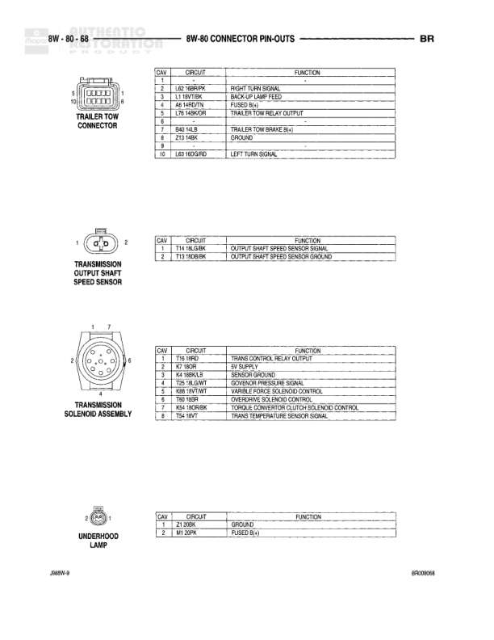

# 8W-80 CONNECTOR PIN-OUTS - BR

**Notes:** This is a connector pin-out reference page showing the pin assignments for three components: Water in Fuel Sensor (Diesel), Windshield Washer Pump Motor, and Wiper Motor. Document reference: J8BW4, BP0502879

## Components

| Component | Ref | Connectors | Notes |
|-----------|-----|------------|-------|
| Water in Fuel Sensor (Diesel) | 8W-80-70 | 2-pin connector | Diesel engine only |
| Windshield Washer Pump Motor | 8W-80-70 | 2-pin connector | None |
| Wiper Motor | 8W-80-70 | 4-pin connector | None |

## Wires

| From | To | Wire Code | Gauge | Color | Notes |
|------|-----|-----------|-------|-------|-------|
| Water in Fuel Sensor | Pin 1 | None | None | None | K1 18DBRD - Water in Fuel Sensor Signal |
| Water in Fuel Sensor | Pin 2 | None | None | None | K4 20BKLB - Sensor Ground |
| Windshield Washer Pump Motor | Pin 1 | None | None | None | V10 18BR - Washer Pump Control Switch Output |
| Windshield Washer Pump Motor | Pin 2 | None | None | None | Z1 20BK - Ground |
| Wiper Motor | Pin 1 | None | None | None | V4 16DBYL - Wiper Switch High Speed Output |
| Wiper Motor | Pin 2 | None | None | None | V3 18VT - Wiper Switch Low Speed Output |
| Wiper Motor | Pin 3 | None | None | None | V5 16DB - Fused B(+) Switch Output |
| Wiper Motor | Pin 4 | None | None | None | V3 16BRWT - Wiper Switch Low Speed Output |
