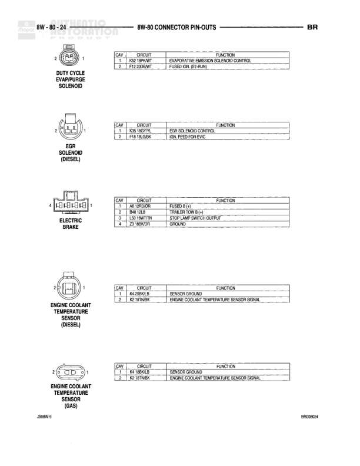

# BR AUTOMATIC - 8W-80 CONNECTOR PIN-OUTS

**Notes:** This diagram shows connector pin-out specifications for BR AUTOMATIC transmission system. Multiple connector views show pin assignments and wire circuits. Document references BR020039 and JA8W-9.

## Components

| Component | Ref | Connectors | Notes |
|-----------|-----|------------|-------|
| BYPASS JUMPER (A/T) | Top Left |  | 2-pin connector with GREEN wires - T44 14YL/RD, A81 14YL |
| BYPASS JUMPER (A/T) | Top Right |  | 2-pin connector with GREEN wires - T44 14YL/RD, T14 14YL/RD |
| C105 | 8W-80-9 | C105 | 3-pin connector, circuits: Z1 20BK, L38 20LB, Z1 20BK |
| C106 | 8W-80-9 | C106 | 2-pin connector, BLACK, circuits: D157 18BK/GY, Z1 18BK |
| C106 | 8W-80-9 | C106 | 2-pin connector, BLACK, circuits: D157 20BK/GY, Z1 20BK |
| C114 | 8W-80-9 | C114 | 2-pin connector, BLACK, circuits: G31 20VT/LG, D33 20BK/YL |
| C114 | 8W-80-9 | C114 | 2-pin connector, BLACK, circuits: G31 20VT/LG, D33 20BK/YL |
| C119 | 8W-80-9 | C119 | 2-pin connector, circuits: T42 12BR, T42 14BR |
