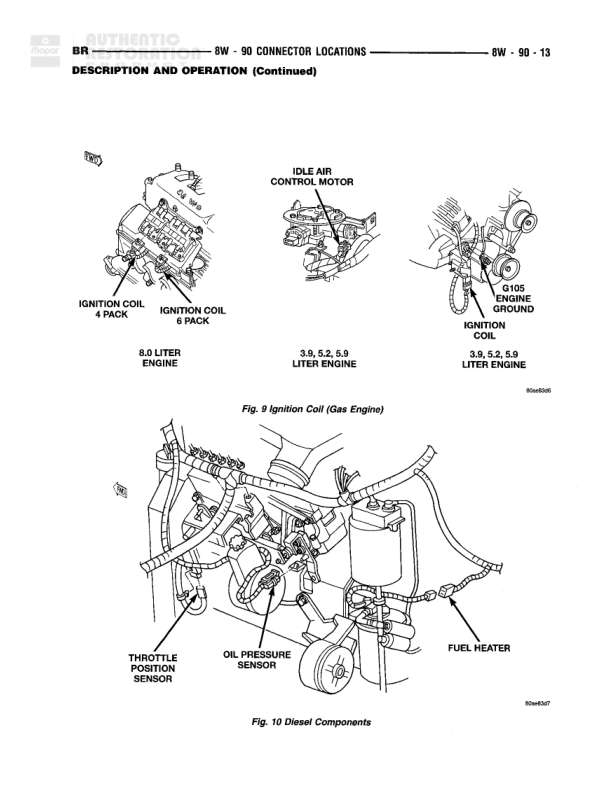

# CONNECTOR LOCATIONS

**Notes:** This is a connector location reference page (8W-90-1) that provides a table of connector identifications, colors, locations, and figure numbers. It includes connectors for A/C system, airbag control, lighting, HVAC, and various other vehicle systems. N/S indicates items not shown in figures. Users are instructed to refer to wiring diagrams in each section for connector number identification and to use the index for proper figure numbers.

## Components

| Component | Ref | Connectors | Notes |
|-----------|-----|------------|-------|
| A/C Compressor Clutch | A/C Compressor |  |  |
| A/C Heater Control Switch | A/C Heater Control Switch |  |  |
| A/C High Pressure Switch | A/C High Pressure Switch |  |  |
| A/C Low Pressure Switch | A/C Low Pressure Switch |  |  |
| Airbag Control Module | Airbag Control Module |  |  |
| Ambient Temperature Sensor | Ambient Temperature Sensor |  |  |
| Ash Receiver Lamp | Ash Receiver Lamp |  |  |
| Backup Lamp Switch | Backup Lamp Switch |  |  |
| Battery Temperature Sensor | Battery Temperature Sensor |  |  |
| Blower Motor | Blower Motor |  |  |
| Blower Motor Resistor Block | Blower Motor Resistor Block |  |  |
| Brake Pressure Switch | Brake Pressure Switch |  |  |
| Bypass Jumper | Bypass Jumper |  |  |
| C105 | C105 | C105 |  |
| C106 | C106 | C106 |  |
| C114 | C114 | C114 |  |
| C119 | C119 | C119 |  |
| C125 | C125 | C125 |  |
| C126 | C126 | C126 |  |
| C128 | C128 | C128 |  |
| C129 | C129 | C129 |  |
| C130 | C130 | C130 |  |
| C132 | C132 | C132 |  |
| C134 | C134 | C134 |  |
| C183 | C183 | C183 |  |
| C203 | C203 | C203 |  |
| C204 | C204 | C204 |  |
| C208 | C208 | C208 |  |
| C237 | C237 | C237 |  |
| C303 | C303 | C303 |  |
| C308 | C308 | C308 |  |
| C329 | C329 | C329 |  |
