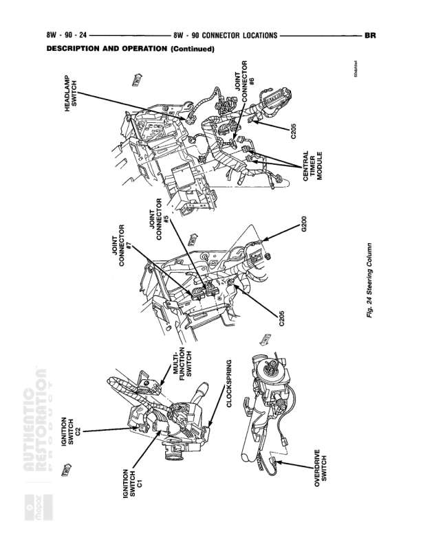

# Connector Locations - Description and Operation (Continued)

**Notes:** This page shows physical connector locations for different engine configurations: 8.0 Liter Engine (with 4-pack and 6-pack ignition coils), 3.9/5.2/5.9 Liter Gas Engines (with idle air control motor and single ignition coil), and Diesel Components (with throttle position sensor, oil pressure sensor, and fuel heater). Referenced as Fig. 9 Ignition Coil (Gas Engine) and Fig. 10 Diesel Components. This is a connector location reference page, not a wiring diagram with wire connections.

## Components

| Component | Ref | Connectors | Notes |
|-----------|-----|------------|-------|
| Ignition Coil 4 Pack | 8.0 Liter Engine |  | For 8.0 Liter Engine configuration |
| Ignition Coil 6 Pack | 8.0 Liter Engine |  | For 8.0 Liter Engine configuration |
| Idle Air Control Motor | 3.9, 5.2, 5.9 Liter Engine |  | For 3.9, 5.2, 5.9 Liter Engine configuration |
| Ignition Coil | 3.9, 5.2, 5.9 Liter Engine |  | For 3.9, 5.2, 5.9 Liter Engine configuration, includes G105 Engine Ground connection |
| Throttle Position Sensor | Diesel Components - Fig. 10 |  | For diesel engine configuration |
| Oil Pressure Sensor | Diesel Components - Fig. 10 |  | For diesel engine configuration |
| Fuel Heater | Diesel Components - Fig. 10 |  | For diesel engine configuration |

## Splices & Grounds

| ID | Type | Location | Wires Connected | Notes |
|----|------|----------|-----------------|-------|
| G105 | ground | Engine Ground - on engine for 3.9, 5.2, 5.9 Liter engines |  | Engine ground point shown in Fig. 9 Ignition Coil (Gas Engine) |
