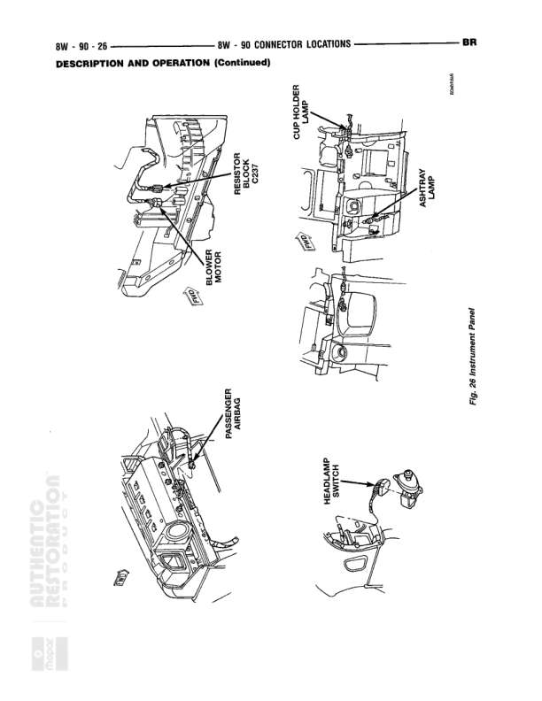

# Connector Locations

**Notes:** This is a connector location reference diagram (Fig. 12) showing physical placement of connectors for Transmission/Converter components. No actual wiring connections are shown - this is a mechanical reference diagram for locating connectors on the transmission assembly. Multiple oxygen sensor locations are illustrated along with transmission-related sensor and switch connector positions.

## Components

| Component | Ref | Connectors | Notes |
|-----------|-----|------------|-------|
| Oxygen Sensor | 8W-90-15 |  | Multiple locations shown |
| Transmission | 8W-90-15 |  | Connector location shown |
| Speed Sensor | 8W-90-15 |  | V+ labeled, part of transmission assembly |
| Lamp Switch | 8W-90-15 |  | Backup lamp switch location shown |
| Solenoid Switching Portion Wiring | 8W-90-15 |  | Internal transmission wiring shown |
