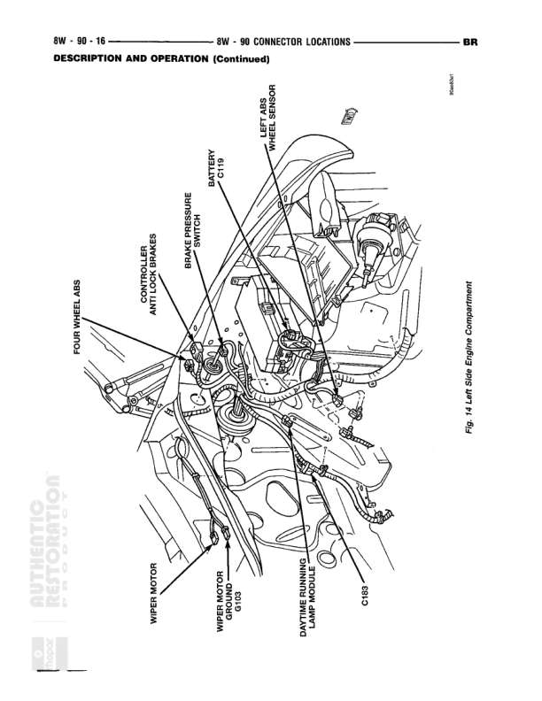

# 8W - 90 CONNECTOR LOCATIONS - DESCRIPTION AND OPERATION (Continued)

**Notes:** This is a connector location diagram showing physical placement of components in the left rear area of the vehicle. Reference note indicates 'Fgr 4 L/Gat Side Engine Compartment'. This diagram shows component locations rather than electrical connections.

## Components

| Component | Ref | Connectors | Notes |
|-----------|-----|------------|-------|
| CONTROLLER ANTI-LOCK BRAKES | 8W-90-16 |  | Anti-lock brake system controller module |
| LIFT GATE AJAR SENSOR | 8W-90-16 |  | Sensor for detecting lift gate open/closed status |
| COURTESY LAMP SWITCH | 8W-90-16 |  | Switch for courtesy lighting control |
| REAR WASHER | 8W-90-16 |  | Rear window washer component |
| WIPER MOTOR | 8W-90-16 |  | Rear wiper motor |
| WIPER MOTOR PARK SENSE | 8W-90-16 |  | Wiper motor park position sensor |
| DAYTIME RUNNING LAMP MODULE | 8W-90-16 |  | Module controlling daytime running lamps |
| CHMSL | 8W-90-16 |  | Center High Mount Stop Lamp |
