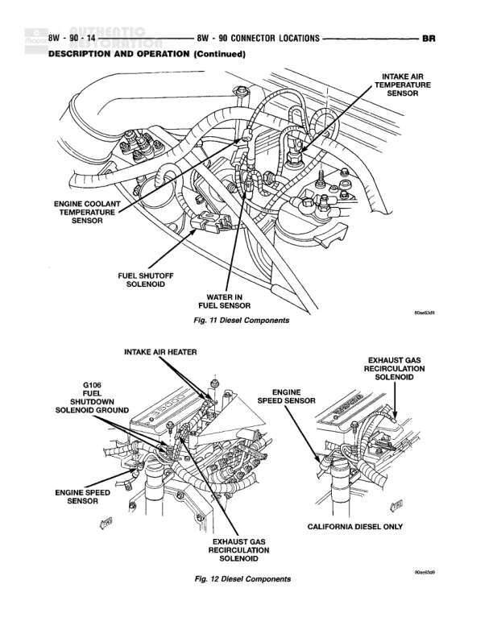

# CONNECTOR LOCATIONS

**Notes:** This is a connector location reference table from the service manual, showing component names, wire colors, physical locations, and pin numbers. Page 8W-90-2 continued from previous page labeled BR.

## Components

| Component | Ref | Connectors | Notes |
|-----------|-----|------------|-------|
| C333 | Below Left Tail Lamp | C333 | BK color, Pin 21 |
| C342 | Left Rear of Frame | C342 | BK color, Pin 21 |
| C343 | Left Rear of Frame | C343 | BK color, Pin 21 |
| C345 | Right Door | C345 | N/S |
| C346 | Right Door | C346 | N/S |
| C347 | Left Door | C347 | N/S |
| C348 | Left Door | C348 | N/S |
| C352 | Left A-Pillar | C352 | BK color, N/S |
| C353 | Right A-Pillar | C353 | BK color, N/S |
| C360 | To Body Wiring | C360 | N/S |
| C361 | To Body Wiring | C361 | N/S |
| C363 | To Passenger Seat Jumper | C363 | N/S |
| C364 | Rear Speakers | C364 | N/S |
| Camshaft Position Sensor | Rear of Distributor |  | Pin 8 |
| Cargo Lamp | Rear of Lamp |  | BK color, N/S |
| Cargo Lamp No. 2 | Rear of Lamp |  | BK color, N/S |
| Center High Mounted Stop Lamp No. 1 | Rear of Lamp |  | BK color, Pin 18 |
| Center High Mounted Stop Lamp No. 2 | Rear of Lamp |  | BK color, Pin 18 |
| Central Door Identification Lamp | Behind Front of Headliner |  | N/S |
| Central Timer Module | Left Side Under Instrument Panel |  | Pin 23, 24 |
| Cigar Lighter Illumination | Behind Cigar Lighter Lamp |  | Pin 25, 25 |
| Clockspring | Steering Column |  | Pin 24 |
| Clutch Pedal Position Switch | Top of Clutch Pedal |  | N/S |
| Controller Anti-Lock Brake C1 | At Controller, Anti-Lock Brakes |  | Pin 14 |
| Controller Anti-Lock Brake C2 | At Controller, Anti-Lock Brakes |  | Pin 14 |
| Crankshaft Position Sensor | Rear of Engine Above Right Side of Engine Block V10 |  | Pin 3, 6 |
| Cup Holder Lamp | At Cup Holder |  | Pin 25, 26 |
| Data Link Connector | Left Bottom of I/P |  | BL color, Pin 23 |
| Day/Night Mirror | Day/Night |  | N/S |
| Daytime Running Lamp Module | Left Fender Side Shield |  | BK color, Pin 14 |
| Distributor Dome Lamp | At Distributor, Behind Dome Lamp |  | Pin 3, 18 |
| Downstream Heated Oxygen Sensor | At Sensor |  | BK color, N/S |
| Driver Airbag | Driver Airbag |  | N/S |
| Driver Seat Solenoid | Drivers Seat |  | N/S |
| Duty Cycle EVAP/Purge Solenoid | Rear of Intake Manifold |  | BK color, Pin 17 |
| Electric Brake | Trailer Tow |  | N/S |
| Engine Coolant Temperature Sensor (Diesel) | Left Rear of Cylinder Head (Diesel) |  | BK color, Pin 11 |
| Engine Coolant Temperature Sensor (Gas) | On Thermostat Housing |  | BK color, Pin 3, 6 |
| Engine Oil Pressure Sensor | Near Distributor V6-V8, Near Oil Filter V10, Left Side of Engine Diesel |  | BK color, Pin 3, 10 |
| Engine Speed Sensor (Diesel) | Front of Engine (Diesel) |  | BK color, Pin 12 |
| Exhaust Gas Recirculation Solenoid | On EGR Solenoid |  | Pin 6, 12 |
