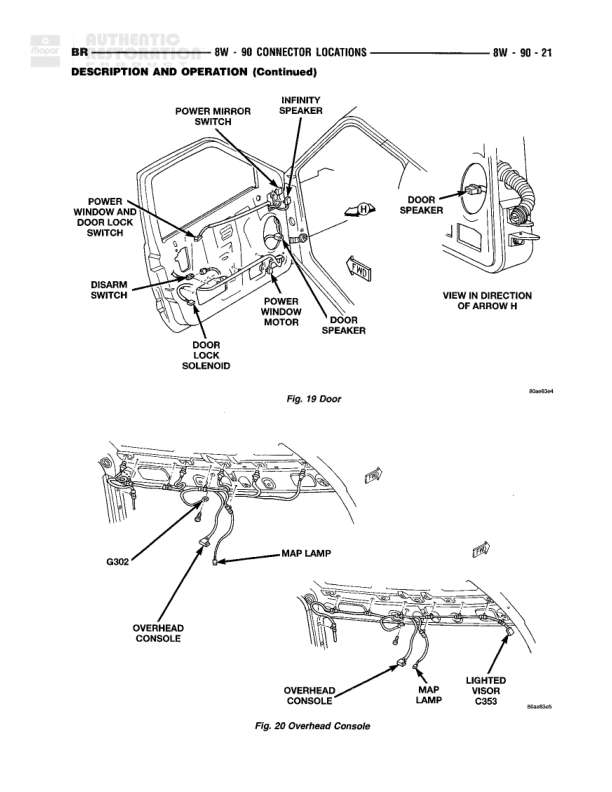

# Connector Locations - Door and Overhead Console

**Notes:** This is a connector location reference diagram showing physical placement of components in the door and overhead console areas. Fig. 19 shows door component locations. Fig. 20 shows overhead console component locations. This is part of the description and operation section for connector locations.

## Components

| Component | Ref | Connectors | Notes |
|-----------|-----|------------|-------|
| Power Mirror Switch | Door location |  | Located in door panel |
| Infinity Speaker | Door location |  | Located in door panel |
| Power Window Motor/Door Lock Switch | Door location |  | Located in door panel |
| Disarm Switch | Door location |  | Located in door panel |
| Power Window Motor | Door location |  | Located in door |
| Door Speaker | Door location |  | Located in door panel, view in direction of arrow H |
| Door Lock Solenoid | Door location |  | Located in door |
| Overhead Console | Overhead location | G302 | Located in overhead console area |
| Map Lamp | Overhead Console |  | Located in overhead console |
| Lighted Visor | C353 | C353 | Located near overhead console |

## Splices & Grounds

| ID | Type | Location | Wires Connected | Notes |
|----|------|----------|-----------------|-------|
| G302 | ground | Overhead console area |  | Ground point for overhead console |
