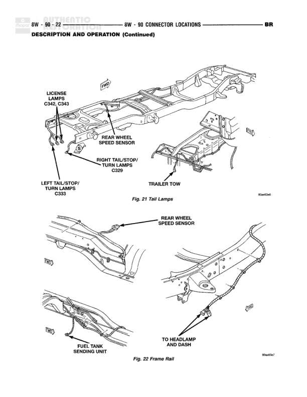

# CONNECTOR LOCATIONS - Tail Lamps and Frame Rail Components

**Notes:** This is a connector location reference diagram showing physical locations of components on the vehicle frame. Figure 21 shows tail lamp and rear component locations. Figure 22 shows frame rail components including rear wheel speed sensor, fuel tank sending unit, and routing to headlamp and dash. This is a description and operation page, not a detailed wiring schematic.

## Components

| Component | Ref | Connectors | Notes |
|-----------|-----|------------|-------|
| LICENSE LAMPS | C342, C343 | C342, C343 | Located on rear frame near license plate area |
| LEFT TAIL/STOP/TURN LAMPS | C328 | C328 | Left rear tail lamp assembly |
| RIGHT TAIL/STOP/TURN LAMPS | C329 | C329 | Right rear tail lamp assembly |
| REAR WHEEL SPEED SENSOR | Fig. 21, Fig. 22 |  | Mounted on rear axle/frame rail area |
| TRAILER TOW | Fig. 21 |  | Trailer tow connector location on rear frame |
| FUEL TANK SENDING UNIT | Fig. 22 |  | Located on fuel tank |
